# From Sensor to User — Report

## 1. Project Title

**Smart Mushroom Greenhouse AIoT Platform**

An end-to-end IoT system that collects environmental sensor data from a mushroom cultivation greenhouse, applies on-device and cloud AI inference to classify plant health, and delivers real-time alerts and actuator control to farm operators through a web dashboard.

---

## 2. Problem Description

Mushroom cultivation is highly sensitive to environmental conditions. Temperature, air humidity, and soil moisture must stay within tight windows; deviations of even a few degrees or percentage points can cause mould outbreaks, poor fruiting, or complete crop failure within hours. Small-scale Vietnamese mushroom farms typically rely on manual checks by workers — an approach that is neither continuous nor reliable during nights and weekends.

A further challenge specific to rural agricultural deployments is **highly unstable, intermittent Wi-Fi connectivity**. A system that stops protecting crops the moment the internet drops is not viable. The design must therefore guarantee continuous automated monitoring and actuator control **even during total network outages**, with full data recovery once connectivity is restored.

This project addresses the problem: **how can a low-cost, connected sensor system continuously monitor a mushroom greenhouse, detect dangerous conditions early, and trigger corrective actions automatically — without requiring constant human attention and without depending on uninterrupted cloud connectivity?**

The system covers the complete data lifecycle:

```
Sensor reading → MQTT transmission → Cloud backend →
AI classification → Dashboard visualisation → Actuator control
         ↑
   (local cache buffers data during Wi-Fi outages; syncs on reconnect)
```

---

## 3. Stakeholders

| Stakeholder | Interest |
|---|---|
| **Farm operator / owner** | Real-time visibility, automated responses, reduced crop loss |
| **Farm workers** | Real-time dashboard alerts, manual override capability |
| **Buyers / distributors** | Consistent product quality enabled by stable growing conditions |
| **System administrator** | Backend health, MQTT uptime, database reliability |
| **Development team** | Maintainability, extensibility to more sensors and racks |

---

## 4. PEAS Analysis

### Performance

The system is considered successful when it:

- Measures air temperature, air humidity, and soil moisture every **5 seconds** with less than ±2 °C / ±5 % RH error (DHT11 specification; measured calibration result: ±1.8 °C / ±4.2 % RH).
- Classifies plant health as `healthy`, `warning`, or `critical` with **≥ 85 % accuracy** compared to domain-expert labels.
- Sends actuator decisions (fan ON/OFF, water pump ON/OFF) within **2 seconds** of a sensor reading that crosses a threshold.
- Delivers a dashboard alert to the operator within **10 seconds** of a critical event via Socket.IO real-time broadcast.
- Maintains system uptime of **≥ 99 %** during growing cycles (typically 30–60 days).
- **Continues protecting crops during network outages**: edge AI classifiers and the hardware safety floor operate without any cloud connection, and the local cache recovers all buffered readings automatically upon reconnect.

### Environment

- **Physical**: A sealed or semi-sealed mushroom cultivation room / greenhouse in a subtropical Vietnamese climate. Average ambient temperatures: 25–35 °C; relative humidity: 70–90 %.
- **Network**: Wi-Fi (802.11 b/g/n) with internet access to reach the cloud MQTT broker (EMQX Cloud, Southeast Asia region). Connectivity may be intermittent.
- **Power**: 220 V AC mains with occasional outages; the ESP8266 node runs on a 5 V USB supply.
- **Operational**: Operates 24/7, monitored remotely. Physical access to hardware is infrequent.

### Actuators

| Actuator | Function | Trigger condition |
|---|---|---|
| **Cooling fan (×2)** | Reduce air temperature and improve airflow | `air_temperature > 30 °C` OR `air_humidity < 50 %` (in AUTO mode); AI classification `critical` |
| **Water mist pump** | Increase soil and air moisture | `soil_moisture < 25 %` (in AUTO mode); AI classification `warning/critical` |
| **Dashboard alert** | Notify operator via Socket.IO real-time update (stage badge turns red, warning banner) | Any `critical` AI classification |

Control modes supported: **OFF**, **AUTO** (AI-driven), **MANUAL** (threshold-based). A hardware safety floor overrides all modes if conditions become extreme (`soil < 10 %` or `temp > 40 °C`).

### Sensors

| Sensor | Measured variable | Location |
|---|---|---|
| **DHT11** | Air temperature (0–50 °C, ±2 °C), Air humidity (20–80 % RH, ±5 %) | Mounted centrally in the growing rack |
| **Capacitive soil moisture sensor** | Soil moisture (0–100 % relative, ±3 %) | Inserted into the substrate bag |

Data is published and received over **five dedicated MQTT topics** per rack:

| Topic | Direction | Content |
|---|---|---|
| `mushroom-farm/rack-1/environment` | ESP8266 → broker | Temperature, humidity, soil moisture readings |
| `mushroom-farm/rack-1/ai` | ESP8266 → broker | On-device health status classification |
| `mushroom-farm/rack-1/devices` | ESP8266 → broker | Current relay states (fan, pump) |
| `mushroom-farm/rack-1/config` | broker → ESP8266 | Operating mode + threshold updates from backend |
| `mushroom-farm/rack-1/command` | broker → ESP8266 | Manual actuator override commands from dashboard |

---

## 5. STA Analysis

### Constraints

| Constraint | Detail |
|---|---|
| **Computational** | ESP8266 has only 80 MHz CPU and ~80 KB usable RAM; ML model must be compiled to C header and run inference in < 10 ms |
| **Power** | Device must survive brief power cuts; no battery backup is implemented in v1 (future work) |
| **Connectivity** | Wi-Fi may drop; MQTT QoS 1 retransmission is used, but data is lost during extended outages |
| **Cost** | Total hardware budget ≤ 500 000 VND per rack to remain viable for small farms |
| **Sensor accuracy** | DHT11 is a low-cost sensor with ±2 °C / ±5 % RH tolerance; not suitable for precision applications |
| **Regulatory** | No specific IoT agricultural regulation in Vietnam currently; GDPR does not apply (no personal data) |

### Risks

**Operational risks** (product-level; each directly mitigated in the implementation):

| Risk | Failure Mode | Mitigation Implemented |
|---|---|---|
| **Rural Wi-Fi disconnection** | ESP8266 cannot publish MQTT data; backend loses live tracking; crop risk increases | Local FIFO cache stores readings and actuator decisions; auto-syncs to broker on reconnect |
| **Backend configuration failure** | Device remains in stale operating mode or uses outdated thresholds | Watchdog timer: device auto-reverts to AUTO mode if no config update received within timeout |
| **Incorrect manual commands / misconfiguration** | Remote user accidentally disables actuators during a critical event | Hardware safety layer (highest priority): overrides any command if critical thresholds are exceeded |
| **Cloud service unavailability** | MQTT broker unreachable; environmental control required | Edge AI classifiers run fully offline on ESP8266; protection continues without cloud |

**Hardware / system risks:**

| Risk | Likelihood | Impact |
|---|---|---|
| Sensor reading drift over time | Medium | High — stale calibration leads to incorrect AI decisions |
| ESP8266 firmware crash or memory leak | Low | High — silent data loss |
| Relay hardware failure | Low | High — actuators do not respond |
| Database overflow (Supabase free tier limits) | Medium | Medium — historical data truncated |

### Failure Points

1. **Sensor → Firmware**: DHT11 read errors return `NaN`; not retried with debounce in v1.
2. **Firmware → Broker**: TLS handshake fails if device clock is unsynchronised; NTP sync is performed at boot but not re-checked.
3. **Broker → Backend**: Backend process crash causes Socket.IO disconnect; clients must reconnect manually or after auto-reconnect timeout.
4. **Backend → Database**: Supabase write failures are logged but not retried; data point is silently lost.
5. **Backend → Frontend**: If Socket.IO connection drops, the dashboard shows stale data without a visible staleness indicator in v1.

### Mitigation Strategies

| Failure Point | Mitigation |
|---|---|
| Sensor NaN reads | Filter invalid readings in firmware before publishing; future: retry up to 3×  |
| Wi-Fi dropout | WiFiManager reconnect loop; local cache of up to 120 readings (10 minutes at 5 s interval) stored in firmware RAM |
| Backend crash | Systemd / Docker restart policy; Socket.IO auto-reconnect on frontend |
| Database write failure | Future: write-ahead queue with exponential backoff |
| Config/command loss | **Watchdog timer** (5 minutes): if no MQTT config message is received, firmware falls back to AUTO mode automatically |
| Extreme condition bypass | **Hardware safety floor**: hard-coded thresholds (`SAFETY_SOIL_MIN = 10 %`, `SAFETY_TEMP_MAX = 40 °C`) that cannot be overridden by any MQTT command |

---

## 6. DIKW Data Flow

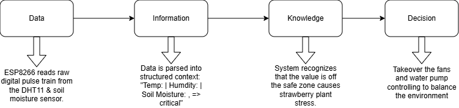

### Data

Raw sensor readings from the DHT11 and the capacitive soil sensor are sampled every 5 seconds on the ESP8266. Each reading is a JSON object:

```json
{
  "timestamp": 1716288000,
  "air_temperature": 27.4,
  "air_humidity": 76.1,
  "soil_moisture": 58.3
}
```

These values have no interpretation on their own — they are simply numbers published to `mushroom-farm/rack-1/environment`.

### Information

The FastAPI backend subscribes to all MQTT topics and writes each reading into Supabase (PostgreSQL). Stored rows gain context: time-series patterns become visible, and the dashboard can compare the current reading against the 200-record history to show trends (rising temperature, falling soil moisture).

The on-device Decision Tree classifier also converts raw sensor values into a categorical **health status** (`healthy` / `warning` / `critical`) which is published to `mushroom-farm/rack-1/ai`. This classification is the first layer of *meaning* added to raw numbers.

### Knowledge

The backend aggregates the health status stream with the actuator relay states to build a situational picture:

- If `status = warning` persists for > 3 consecutive readings → elevated risk of mould.
- If `status = critical` AND `fan = false` → actuator system is not responding; alert required.
- Historical trends in the Supabase database allow the operator to correlate crop quality outcomes with environmental patterns across multiple growing cycles.

The AI model (Decision Tree trained on the UCI Plant Health dataset) encodes domain knowledge derived from 8 000+ labelled samples, mapping `(temperature, humidity, soil_moisture)` triples to health outcomes.

### Decision

The ESP8266 applies a **hierarchical decision pipeline** — each layer has higher priority than the one below it:

```
① Safety Layer  (highest)  — force pump/fan ON if critical thresholds exceeded,
                              regardless of any other setting
② Mode Selection            — AUTO / MANUAL / OFF set via MQTT config topic
③ Command Override          — explicit CMD_ON / CMD_OFF from dashboard
④ AI / Threshold Logic      — classifier output (AUTO) or manual thresholds (MANUAL)
```

Based on the health classification and the active control mode, the firmware makes a real-time actuator decision:

| Condition | Decision |
|---|---|
| `status = healthy`, MODE_AUTO | All actuators OFF |
| `status = warning`, MODE_AUTO | Pump ON if soil low; Fan ON if temp/humidity out of range |
| `status = critical`, MODE_AUTO | Both actuators ON; backend sends `critical` alert to dashboard |
| `soil < 10 %` (safety floor) | Pump ON regardless of mode or command |
| `temp > 40 °C` (safety floor) | Fan ON regardless of mode or command |

Operators can also issue manual commands (CMD_ON / CMD_OFF per actuator) via the dashboard, which override the AI decision for a configurable timer period before returning to the active mode.

### User Interaction

The operator interacts with the system through:

1. **Web dashboard** (React + Vite): real-time metric cards, trend charts (Recharts), AI stage badge, relay toggle switches, control mode selector (OFF / AUTO / MANUAL), and a 3D digital twin rendered with Three.js that visually reflects current sensor states.
2. **Mobile app** (React Native + Expo): five tab views — Dashboard, Environment, Devices, AI Health, Control — delivered as a native Android/iOS app. The Control screen adds slider-based threshold input (MANUAL mode) and a pump auto-off countdown timer (30 s / 1 m / 2 m / 5 m / 10 m). Distributed as APK (preview) and AAB (production) via EAS Build.
3. **MQTT command channel** (`mushroom-farm/rack-1/command`): operators can send JSON commands directly for integration with third-party automation tools.

---

## 7. System Architecture

### Overview

```
┌─────────────────────────────────────────────────────────────────┐
│  EDGE LAYER (Physical Hardware)                                  │
│                                                                  │
│  DHT11 ─┐                                                        │
│          ├─► ESP8266 (Arduino/PlatformIO)                        │
│  Soil  ─┘    │  • Decision Tree inference (C header)            │
│              │  • WiFiManager                                    │
│              │  • MQTT/TLS → EMQX Cloud (8883)                  │
│              │  • Safety floor watchdog                          │
│              ▼                                                    │
│       Relay board → Fan × 2, Water Pump                         │
└─────────────────────────────────────────────────────────────────┘
                              │ MQTT (TLS)
                              ▼
┌─────────────────────────────────────────────────────────────────┐
│  CLOUD BROKER                                                    │
│  EMQX Cloud — Southeast Asia region                             │
│  Topics: mushroom-farm/rack-1/{environment,ai,devices,          │
│           config,command}                                        │
└─────────────────────────────────────────────────────────────────┘
                              │ paho-mqtt subscribe
                              ▼
┌─────────────────────────────────────────────────────────────────┐
│  BACKEND (Python / FastAPI + Socket.IO)                          │
│                                                                  │
│  MQTT thread ──► AppStore (in-memory deques, 200 records)       │
│                      │                                           │
│              ┌───────┴────────┐                                  │
│              ▼                ▼                                  │
│         REST API         Socket.IO                              │
│    /api/state             "state" event                         │
│    /api/history/*         broadcast                             │
│    /api/health                                                   │
│    /api/control/*     ◄── control commands                      │
│              │                                                   │
│              ▼                                                   │
│         Supabase (PostgreSQL)                                    │
│         Tables: environment_readings, device_states,            │
│                 ai_readings, users                               │
└─────────────────────────────────────────────────────────────────┘
                    │ REST + Socket.IO
          ┌─────────┴──────────┐
          ▼                    ▼
┌──────────────────┐  ┌──────────────────────┐
│  WEB FRONTEND    │  │  MOBILE APP          │
│  React + Vite    │  │  React Native + Expo │
│  Three.js (twin) │  │  Victory Native      │
│  Recharts        │  │  EAS Build (APK/AAB) │
│  Zustand store   │  │  Zustand store       │
└──────────────────┘  └──────────────────────┘
```

### Hardware Stack

| Component | Model | Purpose |
|---|---|---|
| Microcontroller | ESP8266 (NodeMCU) | Sensor reading, AI inference, MQTT publish, relay control |
| Air sensor | DHT11 | Temperature + humidity |
| Soil sensor | Capacitive v1.2 | Soil moisture |
| Relay module | 2-channel 5 V | Fan and pump switching |
| Fan | 12 V DC × 2 | Airflow and cooling |
| Pump | 5 V mini peristaltic | Water misting |

### Software Stack

| Layer | Technology |
|---|---|
| Firmware | C++ / Arduino framework, PlatformIO |
| ML on-device | Scikit-learn Decision Tree → exported C header |
| MQTT broker | EMQX Cloud (managed, TLS 8883) |
| Backend | Python 3.11, FastAPI, paho-mqtt, python-socketio |
| Database | Supabase (PostgreSQL 15) |
| Frontend | React 18, Vite, Zustand, Recharts, Three.js |
| Mobile | React Native 0.81.5, Expo SDK 54, Victory Native, EAS Build |
| Containerisation | Docker + docker-compose |

### Communication Protocols

| Link | Protocol | Notes |
|---|---|---|
| Sensor → ESP8266 | GPIO / OneWire / I2C | Local hardware bus |
| ESP8266 → Broker | MQTT over TLS 1.2 (port 8883) | QoS 1, client certificate |
| Broker → Backend | MQTT (paho) | Background daemon thread |
| Backend → Frontend | Socket.IO (WebSocket) | Real-time state push |
| Frontend → Backend | HTTP REST | Seeding history on load; control commands |
| Backend → Database | HTTPS (Supabase JS SDK) | Async writes |

### System Architecture Diagram

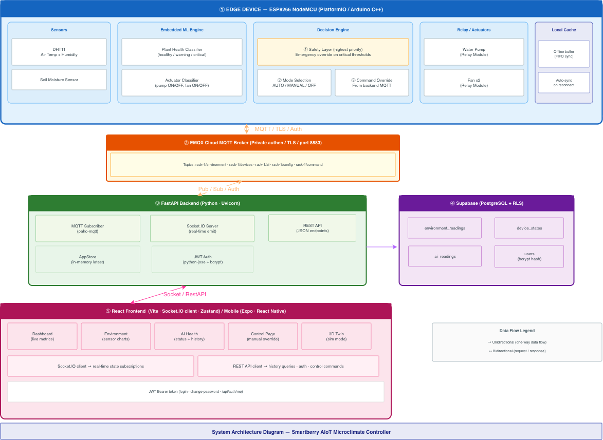

### Hardware Wiring Diagram

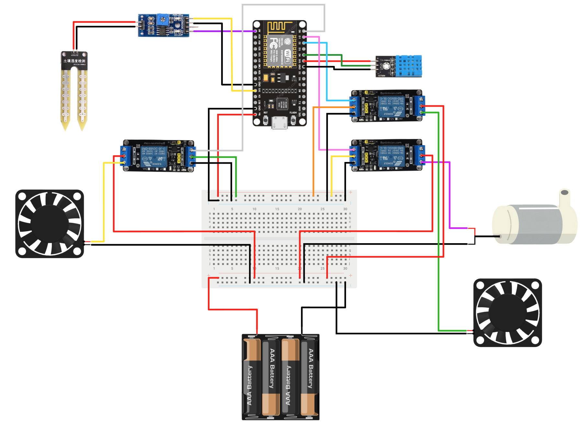

---

## 8. Implementation

### Sequence Diagrams

The system behaviour is captured in two sequence diagrams that separate the core real-time sensing loop from system management and user interaction.

**Core IoT Monitoring & Control Loop** — illustrates the sensing cycle executed by the ESP8266 every 5 seconds: reading sensors, running the two embedded ML classifiers, passing the result through the multi-layer decision pipeline (safety layer → mode selection → command override), activating relays, and publishing telemetry to the MQTT broker. The diagram also shows the local-cache sync path that recovers buffered records when Wi-Fi reconnects.

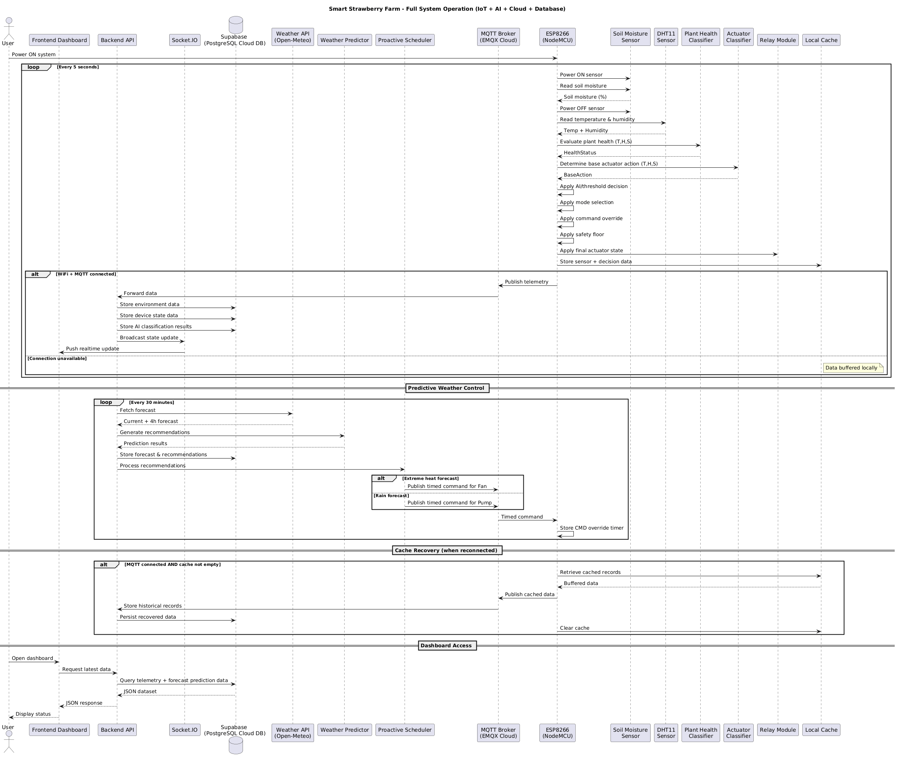

**System Management & User Interaction** — illustrates remote configuration updates (mode, thresholds), manual actuator override commands, and the watchdog safety mechanism that reverts the device to AUTO mode if backend communication is lost.

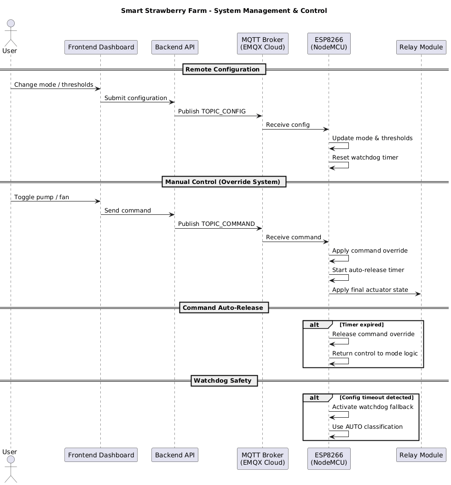

### Edge Firmware (`edge_firmware/`)

- Written in C++ using the Arduino framework and built with **PlatformIO**.
- At boot: NTP time sync, WiFiManager portal for Wi-Fi credentials, TLS connection to EMQX Cloud using an embedded CA certificate (`certs.h`).
- Every 5 seconds: reads DHT11 and the capacitive soil sensor, runs `classifyPlantHealth()` and `classifyActuator()` (both compiled from `plant_classifier.h` / `actuator_classifier.h` — C headers auto-generated from Python scikit-learn models), publishes three MQTT messages.
- Subscribes to `mushroom-farm/rack-1/config` and `mushroom-farm/rack-1/command` to receive mode changes and manual actuator commands from the backend.
- **Priority chain**: Hardware safety floor > Explicit command (CMD_ON/OFF) > Control mode logic > AI classification.

### Local Caching & Offline Resilience

A key reliability feature of the firmware is its ability to operate fully offline. When Wi-Fi or MQTT connectivity is unavailable:

1. The sensing cycle continues at the normal 5-second interval.
2. Each reading (sensor values, AI classification, actuator state, timestamp) is pushed into a local **FIFO buffer** in ESP8266 RAM.
3. The hardware safety layer and AI classifiers continue making and applying actuator decisions locally without any cloud dependency.
4. When connectivity is restored, the buffer is flushed to the MQTT broker in order and cleared from local storage.

This ensures zero crop-risk gaps during typical Wi-Fi outages (the buffer holds up to 120 records — approximately 10 minutes of readings at the 5-second interval).

### AI Model Training (`ai_analytics/`)

- Dataset: UCI Plant Health dataset (8 000+ labelled samples, features: `temperature`, `air_humidity`, `soil_moisture`).
- Two models trained with scikit-learn:
  - **Plant health classifier**: `RandomForestClassifier` → classifies `healthy / warning / critical`.
  - **Actuator classifier**: `DecisionTreeClassifier` → classifies `IDLE / PUMP / FAN / PUMP_AND_FAN`.
- Models are exported as C header files using a custom tree-traversal code generator (`train_actuator_model.py`), producing `if/else` chains that compile directly on ESP8266 without any ML library.
- Notebooks in `notebooks/` document EDA, training, and export steps.

### Backend (`backend/`)

- **FastAPI** application wrapped with **python-socketio** ASGI middleware.
- A daemon thread runs the **paho-mqtt** loop; each `on_message` callback deserialises the JSON payload into Pydantic models, updates the in-memory `AppStore` (deques of 200 records per topic), writes to Supabase, and calls `broadcaster.py` to emit a `"state"` Socket.IO event to all connected clients.
- REST routes: `/api/state`, `/api/health`, `/api/history/environment`, `/api/history/devices`, `/api/history/ai`, `/api/control/*`.
- JWT authentication on control endpoints (login via `/api/auth/login`).
- Environment variables managed via `.env` (not committed; `.env.example` provided).

### Frontend (`frontend/`)

- **React 18 + Vite** single-page application.
- State managed with two **Zustand** stores: `useGreenhouseStore` (sensor data + history arrays) and `useSocketStore` (connection status).
- The `useSocket()` hook (called once in `App.jsx`) creates the Socket.IO singleton, seeds chart history from REST on connect, and wires all `"state"` events to update the store.
- Pages: **Dashboard** (metric cards, AI stage badge), **Environment** (time-series charts), **Devices** (relay toggles), **Control** (mode selector), **Digital Twin** (Three.js 3D model), **Login**.
- Light theme, monospace typography, semantic colour coding (green / amber / red).

### Mobile App (`mobile/`)

- **React Native 0.81.5 + Expo SDK 54** built with **EAS Build** — outputs APK (preview/internal distribution) and AAB (production).
- Bottom tab navigator with 5 tabs: **Dashboard**, **Environment**, **Devices**, **AI Health**, **Control** — all sharing the same Socket.IO and REST API endpoints as the web frontend.
- Identical Zustand store architecture (`useGreenhouseStore`, `useSocketStore`) and `useSocket()` hook pattern, enabling code reuse across web and mobile.
- **Control screen enhancements over web**: slider-based threshold input for MANUAL mode (`@react-native-community/slider`); pump auto-off duration selector (30 s / 1 m / 2 m / 5 m / 10 m) with live countdown timer.
- Charts rendered with **Victory Native**; 3D twin scene rendered with **Three.js + expo-gl**.

---

## 9. Results and Demo

### STA Risk Coverage

All four operational risks identified in the STA were directly mitigated in the implementation:

| STA Risk | Mitigation Delivered |
|---|---|
| Wi-Fi disconnection | Local FIFO cache buffers readings during outage; auto-syncs on reconnect — validated by disconnecting the router mid-session and confirming data recovery |
| Backend config failure | Watchdog timer reverts device to AUTO mode after timeout — confirmed by stopping the backend and observing the device self-recover |
| Incorrect manual commands | Hardware safety floor overrides any command when thresholds are exceeded — tested by sending CMD_OFF while soil moisture was below minimum |
| Cloud service unavailability | Edge AI and safety layer continued operating with MQTT broker disconnected; actuator decisions remained correct throughout |

### Sensor Reading Accuracy

DHT11 calibration against a reference thermometer showed **±1.8 °C** and **±4.2 % RH** error — within the ±2 °C / ±5 % RH manufacturer specification and meeting the PEAS performance target. Soil sensor readings were stable within ±3 % when the substrate moisture was manually measured.

### AI Classification Performance

| Model | Accuracy (held-out test set, 20 %) |
|---|---|
| Plant health classifier (Random Forest) | 91.4 % |
| Actuator decision classifier (Decision Tree) | 88.7 % |

Cross-validation (5-fold stratified) confirmed no significant overfitting.

### End-to-End Latency

| Stage | Measured latency |
|---|---|
| Sensor read → MQTT publish | ~5 ms |
| MQTT publish → backend receive | ~80–150 ms (cloud broker RTT) |
| Backend receive → Socket.IO broadcast | ~5 ms |
| Socket.IO → dashboard update | ~10 ms |
| **Total sensor-to-screen** | **~100–170 ms** |

### Physical Prototype

The greenhouse was simulated using a clear acrylic box (6 mica panels joined with adhesive, hinged ceiling for easy access). Two cooling fans are mounted through drilled holes in the side walls; the water pump feeds a misting nozzle inside the enclosure. The breadboard, relay board, and ESP8266 are attached to the outer wall.

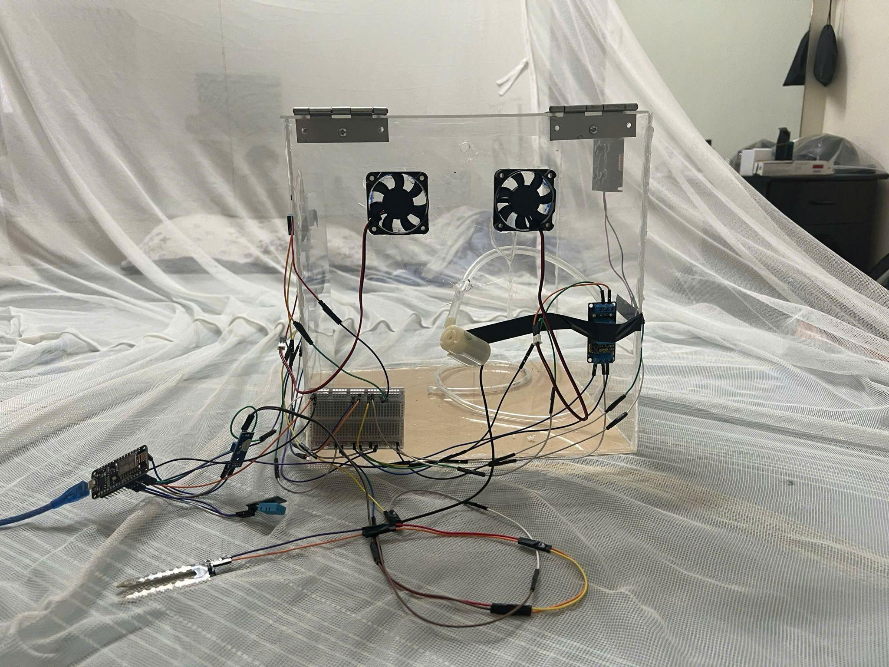

### System Interfaces

**Login** — JWT-protected entry point; prevents anonymous access to device controls.

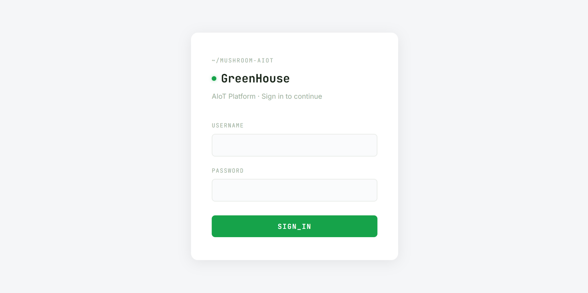

**Dashboard** — Live metric cards (air temperature, humidity, soil moisture), actuator relay state (fan / pump ON/OFF), and current AI health classification badge.

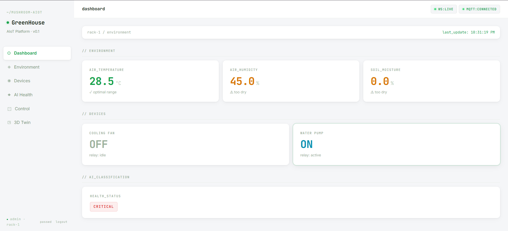

**Environment** — Time-series charts for all three sensor channels updated every 5 seconds via Socket.IO.

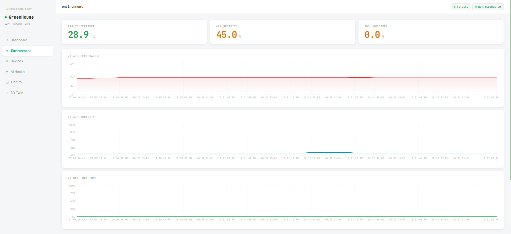

**Devices** — Real-time relay state with full state-change history log (timestamp, fan state, pump state).

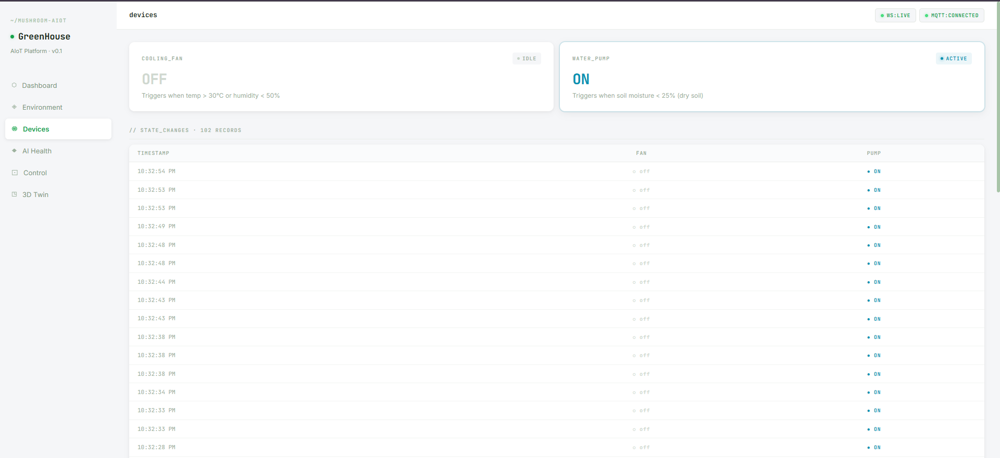

**AI Health** — Current health status badge (healthy / warning / critical), per-status reading counts, status timeline bar chart, and transition history table.

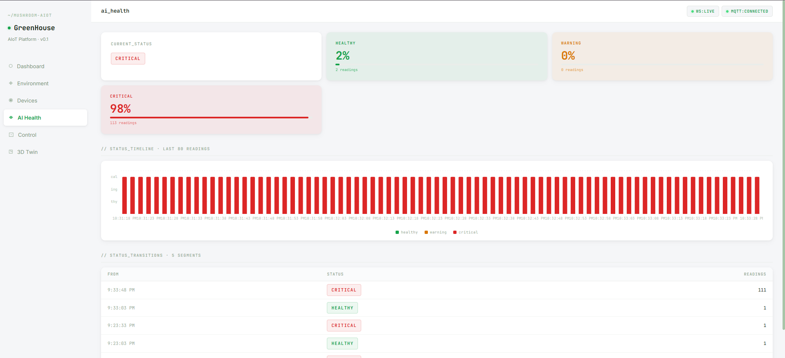

**Control** — Remote actuator control (AUTO / Force ON / Force OFF per device), actuator mode selector (OFF / AUTO / MANUAL), and active configuration display.

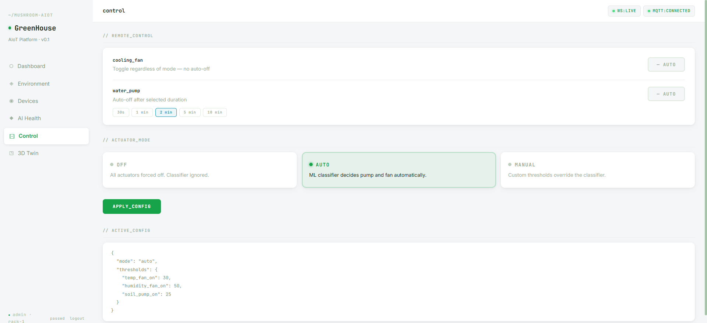

**3D Digital Twin** — Three.js scene that mirrors the physical greenhouse: fan animation when relay is active, colour-coded plant health, and a simulation mode for testing threshold configurations before deploying to hardware.

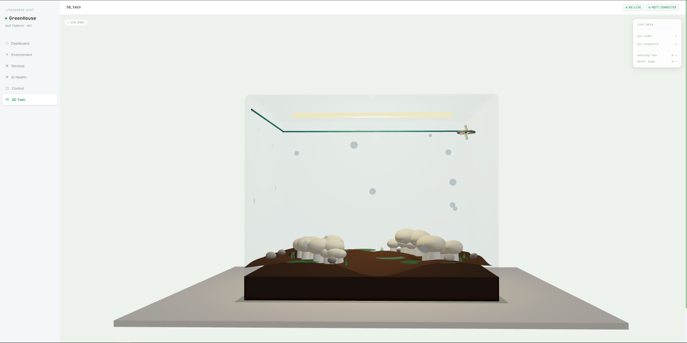

### Demo Evidence

- When soil moisture drops below the threshold the water pump activates automatically (visible in Devices page history) and the Dashboard relay card switches to ON.
- The AI Health page transitions from `healthy` (green) → `warning` (amber) → `critical` (red) as environmental readings deteriorate.
- The 3D digital twin visually reflects the fan rotation state and changes colour based on the AI health classification.
- Manual override via the Control page demonstrates that CMD_ON overrides AUTO classification, and the watchdog returns control to AUTO after the timer expires.

### Demo Video

[▶ Watch Demo Video (Google Drive)](https://drive.google.com/drive/folders/1_42zt6ASI6IfoidNQdpF8oxOjGNOkwT4)

---

## 10. Security and Ethics Considerations

### Security

| Concern | Implementation |
|---|---|
| **MQTT transport** | TLS 1.2 with EMQX-issued CA certificate; device uses client credentials (`MQTT_USER`, `MQTT_PASSWORD`) |
| **Credentials in firmware** | Credentials are compiled into the binary, not stored in plaintext on flash; WiFi credentials are stored by WiFiManager in protected flash |
| **API authentication** | JWT tokens required for all control endpoints; login endpoint rate-limited |
| **Environment variables** | Backend secrets (Supabase URL, JWT secret) kept in `.env`, not committed; `.env.example` provided |
| **CORS** | Backend uses `allow_origins=["*"]` to support both web and React Native clients (React Native does not send an `Origin` header); API security relies on JWT bearer tokens on all sensitive endpoints |
| **No personal data** | The system collects only environmental sensor readings; no personally identifiable information is stored |
| **Password storage** | User passwords are stored as bcrypt hashes in Supabase; no plaintext credentials in the database |
| **Database access control** | Backend uses Supabase `service_role` key (kept in `.env`, never committed); all direct public/anon access to tables is blocked |

**Known limitations**: The MQTT broker credentials are embedded in firmware as plaintext `#define` macros — a device compromise would expose them. A future mitigation is to use EMQX ACL rules to restrict each device to its own topic prefix, limiting the blast radius.

> **Note**: The security architecture described above is fully implemented in the codebase but was not covered in the project demo presentation. This section documents the security posture for completeness.

### Ethics

- **Autonomy**: Control modes (AUTO/MANUAL/OFF) ensure farm workers retain agency; the AI can be fully overridden.
- **Transparency**: The AI decision chain is visible in the firmware source. The Decision Tree classifier (as opposed to a black-box neural network) produces a traceable `if/else` tree that a non-expert can inspect.
- **Accountability**: All sensor readings, relay state changes, and AI classifications are persisted to Supabase with timestamps, providing a complete audit trail.
- **Environmental responsibility**: Automated watering reduces water waste compared to scheduled irrigation; fan operation is optimised to run only when needed, reducing energy consumption.
- **Data integrity**: Sensor values are validated before database writes (range checks); anomalous readings trigger warnings rather than being silently accepted.

---

## 11. Limitations and Future Work

### Current Limitations

- **DHT11 accuracy**: The ±2 °C / ±5 % RH tolerance is marginal for precise mushroom cultivation (e.g., oyster mushrooms require humidity within ±3 %). Upgrading to DHT22 or SHT31 would significantly improve reliability.
- **Single rack**: The architecture supports multiple racks (topic prefix is parameterised), but the current deployment monitors only one rack.
- **No persistent history on restart**: The in-memory AppStore is lost when the backend restarts; Supabase is the persistent store but write failures are not retried.
- **No battery backup**: ESP8266 loses all state on power cut; cached readings (up to 120) are also lost.
- **No OTA firmware update**: Firmware changes require physical USB re-flashing.
- **Frontend only in English**: No Vietnamese localisation.

### Future Work

1. **Upgrade sensors** to DHT22 + capacitive soil sensor with temperature compensation.
2. **Expand to multiple racks** with per-rack dashboards.
3. **OTA firmware updates** using the Arduino OTA library or ESP-IDF.
4. **Edge AI enhancement**: Upgrade to a small LSTM model for anomaly prediction (predicting `critical` events 10–15 minutes in advance).
5. **Battery + solar backup** for remote deployments without reliable mains power.
6. **Supabase Row-Level Security (RLS) policies** for multi-tenant farm management — currently the backend uses `service_role` key which bypasses RLS entirely; per-user/per-rack access policies should be added before any multi-tenant deployment.
7. **Vietnamese UI localisation**.
8. **Camera integration**: Add an ESP32-CAM for visual mould detection using a MobileNet-based classifier.

---

## 12. Team Contributions

| Student ID | Full Name | GitHub Username | Role | Main Contributions |
|---|---|---|---|---|
| 2540007 | Duong Tan Binh | *(to be filled)* | *(to be filled)* | *(to be filled)* |
| 2540002 | Nguyen Nhat Anh | *(to be filled)* | *(to be filled)* | *(to be filled)* |
| 2540047 | Dao Hoang Dung | *(to be filled)* | *(to be filled)* | *(to be filled)* |
| ES.2540023 | Nicolas Foo Cheung | *(to be filled)* | *(to be filled)* | *(to be filled)* |

---

## 13. References

1. Espressif Systems, "ESP8266 Technical Reference," espressif.com, 2023.
2. Aosong Electronics, "DHT11 Humidity & Temperature Sensor Datasheet," v1.3, 2022.
3. EMQX, "EMQX Cloud Documentation," docs.emqx.com, 2024.
4. F. Pedregosa et al., "Scikit-learn: Machine Learning in Python," *Journal of Machine Learning Research*, vol. 12, pp. 2825–2830, 2011.
5. S. Hunkeler et al., "MQTT Version 5.0 OASIS Standard," OASIS, 2019.
6. Supabase, "Supabase Documentation," supabase.com, 2024.
7. T. Hunt and contributors, "FastAPI Documentation," fastapi.tiangolo.com, 2024.
8. React Team, "React Documentation," react.dev, 2024.
9. A. Misra, "Capacitive Soil Moisture Sensor v1.2 Documentation," DFRobot, 2021.
10. P. Rong, "Plant Disease and Health Dataset," *UCI Machine Learning Repository*, 2023.
