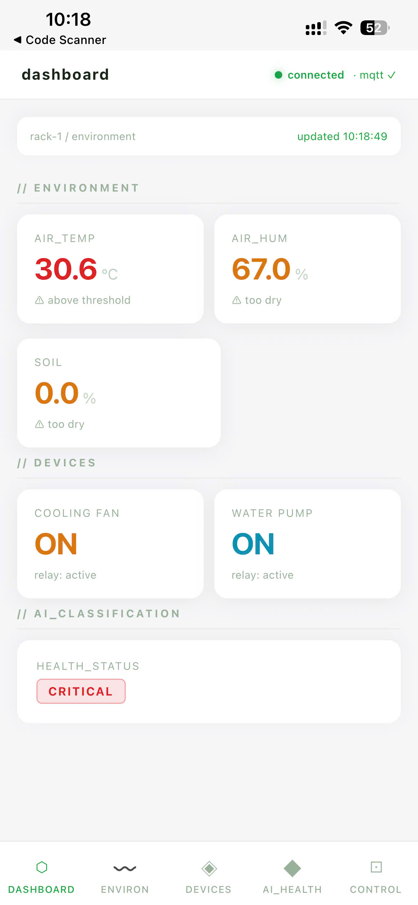
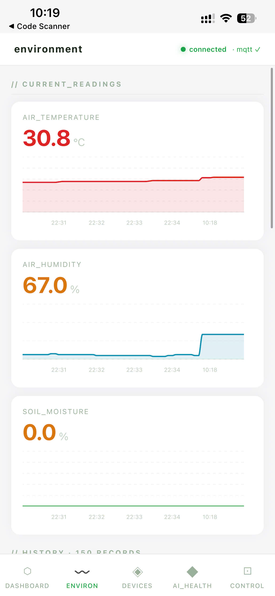
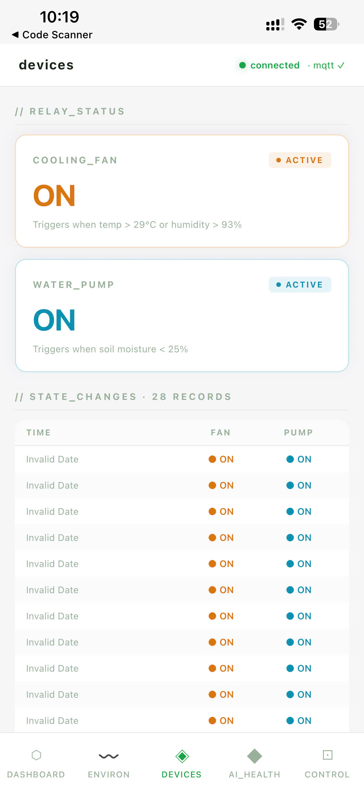
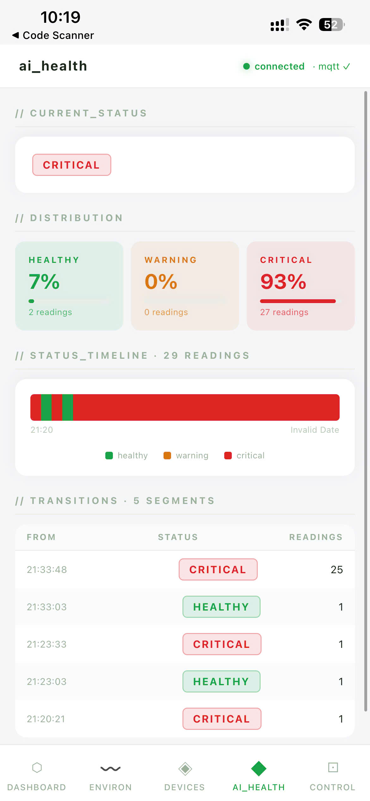
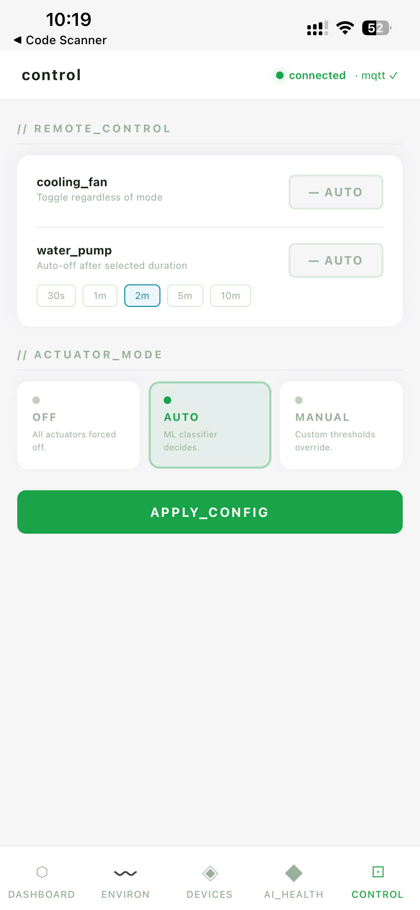

# From Sensor to User — Report

## 1. Project Title

**Smart Mushroom Greenhouse AIoT Platform**

An end-to-end IoT system that collects environmental sensor data from a mushroom cultivation greenhouse, applies on-device and cloud AI inference to classify plant health, and delivers real-time alerts and actuator control to farm operators through a web dashboard.

---

## 2. Problem Description

Mushroom cultivation is highly sensitive to environmental conditions. Temperature, air humidity, and soil moisture must stay within tight windows; deviations of even a few degrees or percentage points can cause mould outbreaks, poor fruiting, or complete crop failure within hours. Small-scale Vietnamese mushroom farms typically rely on manual checks by workers — an approach that is neither continuous nor reliable during nights and weekends.

A further challenge specific to rural agricultural deployments is **highly unstable, intermittent Wi-Fi connectivity**. A system that stops protecting crops the moment the internet drops is not viable. The design must therefore guarantee continuous automated monitoring and actuator control **even during total network outages**, with full data recovery once connectivity is restored.

This project addresses the problem: **how can a low-cost, connected sensor system continuously monitor a mushroom greenhouse, detect dangerous conditions early, and trigger corrective actions automatically — without requiring constant human attention and without depending on uninterrupted cloud connectivity?**

The system covers the complete data lifecycle:

```
Sensor reading → MQTT transmission → Cloud backend →
AI classification → Dashboard visualisation → Actuator control
         ↑
   (local cache buffers data during Wi-Fi outages; syncs on reconnect)
```

---

## 3. Stakeholders

| Stakeholder | Interest |
|---|---|
| **Farm operator / owner** | Real-time visibility, automated responses, reduced crop loss |
| **Farm workers** | Real-time dashboard alerts, manual override capability |
| **Buyers / distributors** | Consistent product quality enabled by stable growing conditions |
| **System administrator** | Backend health, MQTT uptime, database reliability |
| **Development team** | Maintainability, extensibility to more sensors and racks |

---

## 4. PEAS Analysis

### Formal State Space

The agent operates over a continuous environmental state space defined as:

`s = (T, H, M) ∈ ℝ³`

where `T` denotes air temperature (°C), `H` denotes relative air humidity (% RH), and `M` denotes substrate moisture content (% wet basis). The full system state at time step `t` is therefore a trajectory `{s_t}_{t ∈ ℤ⁺}` sampled at a 5-second interval.

**Biologically justified operating windows for *Pleurotus ostreatus*:**

| Variable | Optimal Range | Critical Boundary | Source |
|---|---|---|---|
| `T` — fruiting body temperature | `[18, 28] °C` | `T_critical = 35 °C` (irreversible mycelium damage) | Chang & Miles (2004); Quimio et al. (1990) |
| `H` — relative humidity (pin formation) | `[85, 95] % RH` | `H_min = 70 %` (stipe elongation failure) | Baysal et al. (2003) |
| `M` — substrate moisture, wet basis | `[55, 70] %` | `M_min = 10 %` (desiccation point) | Stamets (2000) |

These thresholds form the biological foundation for every threshold constant defined in the firmware and training pipeline.

### Performance

The performance metric set is formally defined as:

`P = {accuracy ≥ 0.85, latency ≤ 10 s, uptime ≥ 0.99}`

Operationally, the system is considered successful when it:

- Measures `(T, H, M)` every **5 seconds** with errors bounded by ±2 °C / ±5 % RH (DHT11 specification; calibration result: ±1.8 °C / ±4.2 % RH).
- Classifies plant health `ŷ ∈ {healthy, warning, critical}` with **≥ 85 % accuracy** against domain-expert labels.
- Delivers actuator decisions within **2 seconds** of a threshold crossing.
- Delivers a dashboard alert within **10 seconds** of a `critical` event via Socket.IO broadcast.
- Maintains system uptime **≥ 99 %** across growing cycles (typically 30–60 days).
- **Continues protecting crops during network outages**: edge AI classifiers and the hardware safety floor operate without any cloud dependency, and the local cache recovers all buffered readings on reconnect.

### Environment

- **Physical**: A sealed or semi-sealed mushroom cultivation room in a subtropical Vietnamese climate. Average ambient temperature: 25–35 °C; relative humidity: 70–90 %. The target species *Pleurotus ostreatus* (oyster mushroom) is cultivated on lignocellulosic substrate in hanging bags.
- **Network**: Wi-Fi (802.11 b/g/n) with internet access to reach the cloud MQTT broker (EMQX Cloud, Southeast Asia region). Connectivity is intermittent.
- **Power**: 220 V AC mains with occasional outages; the ESP8266 node runs on a 5 V USB supply.
- **Operational**: Operates 24/7, monitored remotely. Physical access to hardware is infrequent.

### Actuators

The action space is discrete:

`A = {IDLE, FAN, PUMP, FAN+PUMP}`

| Actuator | Function | Trigger condition |
|---|---|---|
| **Cooling fan (×2)** | Reduce `T` and improve airflow | `T > 30 °C` OR `H < 50 %` (AUTO mode); AI classification `critical` |
| **Water mist pump** | Increase `M` and `H` | `M < 25 %` (AUTO mode); AI classification `warning` or `critical` |
| **Dashboard alert** | Notify operator via Socket.IO (stage badge turns red, warning banner) | Any `critical` AI classification |

Control modes supported: **OFF**, **AUTO** (AI-driven), **MANUAL** (threshold-based). A hardware safety floor overrides all modes when conditions reach the critical boundary (`M < 10 %` or `T > 40 °C`).

### Sensors

| Sensor | Measured variable | Location |
|---|---|---|
| **DHT11** | Air temperature (0–50 °C, ±2 °C), Air humidity (20–80 % RH, ±5 %) | Mounted centrally in the growing rack |
| **Capacitive soil moisture sensor** | Substrate moisture (0–100 % relative, ±3 %) | Inserted into the substrate bag |

Data is published and received over **five dedicated MQTT topics** per rack:

| Topic | Direction | Content |
|---|---|---|
| `mushroom-farm/rack-1/environment` | ESP8266 → broker | Temperature, humidity, soil moisture readings |
| `mushroom-farm/rack-1/ai` | ESP8266 → broker | On-device health status classification |
| `mushroom-farm/rack-1/devices` | ESP8266 → broker | Current relay states (fan, pump) |
| `mushroom-farm/rack-1/config` | broker → ESP8266 | Operating mode + threshold updates from backend |
| `mushroom-farm/rack-1/command` | broker → ESP8266 | Manual actuator override commands from dashboard |

---

## 5. STA Analysis

### Constraints

| Constraint | Detail |
|---|---|
| **Computational** | ESP8266 has only 80 MHz CPU and ~80 KB usable RAM; the ML model must be compiled to a C header and run inference in < 10 ms |
| **Power** | Device must survive brief power cuts; no battery backup is implemented in v1 (future work) |
| **Connectivity** | Wi-Fi may drop; MQTT QoS 1 retransmission is used, but data is lost during extended outages |
| **Cost** | Total hardware budget ≤ 500 000 VND per rack to remain viable for small-scale farms |
| **Sensor accuracy** | DHT11 carries ±2 °C / ±5 % RH tolerance — marginal relative to the ±3 % RH precision required for *Pleurotus ostreatus* pin formation (Baysal et al., 2003) |
| **Regulatory** | No specific IoT agricultural regulation in Vietnam currently; GDPR does not apply (no personal data collected) |

### Quantitative Risk Matrix (FMEA Approach)

Risk priority is assessed using the standard FMEA Risk Priority Number:

`RPN = Probability (P) × Severity (S) × Detectability (D)`

where each dimension is scored on a 1–5 ordinal scale (1 = lowest risk, 5 = highest). A threshold of `RPN ≥ 12` designates a risk as requiring active mitigation.

**Operational risks** (product-level):

| Risk | Failure Mode | P (1–5) | S (1–5) | D (1–5) | RPN | Priority | Mitigation Implemented |
|---|---|---|---|---|---|---|---|
| Rural Wi-Fi disconnection | MQTT publish fails; backend loses live tracking; crop risk increases undetected | 4 | 4 | 2 | 32 | **High** | Local FIFO cache (120 readings, ~10 min); auto-sync on reconnect |
| Backend configuration failure | Device retains stale mode or outdated thresholds | 2 | 4 | 3 | 24 | **High** | Watchdog timer: auto-revert to AUTO mode after 5-minute silence |
| Incorrect manual command | Remote user disables actuators during a critical event | 2 | 5 | 2 | 20 | **High** | Hardware safety layer overrides any command when `T > 40 °C` or `M < 10 %` |
| Cloud service unavailability | MQTT broker unreachable; environmental control required | 2 | 5 | 2 | 20 | **High** | Edge AI and safety floor run fully offline on ESP8266 |

**Hardware / system risks:**

| Risk | Failure Mode | P (1–5) | S (1–5) | D (1–5) | RPN | Priority |
|---|---|---|---|---|---|---|
| Sensor calibration drift over time | Stale readings cause incorrect AI classifications | 3 | 4 | 3 | 36 | **High** |
| ESP8266 firmware crash / memory leak | Silent data loss; actuators freeze in last state | 2 | 4 | 2 | 16 | **Medium** |
| Relay hardware failure | Actuators do not respond to control signals | 1 | 5 | 2 | 10 | Low |
| Database overflow (Supabase free tier) | Historical data truncated; trend analysis degraded | 3 | 2 | 4 | 24 | **Medium** |

### Failure Points

1. **Sensor → Firmware**: DHT11 read errors return `NaN`; invalid readings are filtered in firmware but not retried with debounce in v1.
2. **Firmware → Broker**: TLS handshake fails if the device clock is unsynchronised; NTP sync is performed at boot but not re-checked mid-session.
3. **Broker → Backend**: Backend process crash causes Socket.IO disconnect; clients must reconnect after auto-reconnect timeout.
4. **Backend → Database**: Supabase write failures are logged but not retried; the affected data point is silently lost.
5. **Backend → Frontend**: If the Socket.IO connection drops, the dashboard shows stale data without a visible staleness indicator in v1.

### Mitigation Strategies

| Failure Point | Mitigation |
|---|---|
| Sensor NaN reads | Filter invalid readings in firmware before publishing; future: retry up to 3× with 100 ms debounce |
| Wi-Fi dropout | WiFiManager reconnect loop; local FIFO cache of up to 120 readings stored in firmware RAM |
| Backend crash | Docker restart policy; Socket.IO auto-reconnect on frontend |
| Database write failure | Future: write-ahead queue with exponential backoff |
| Config/command loss | **Watchdog timer** (5 minutes): firmware falls back to AUTO mode automatically on MQTT silence |
| Extreme condition bypass | **Hardware safety floor**: hard-coded constants (`SAFETY_SOIL_MIN = 10 %`, `SAFETY_TEMP_MAX = 40 °C`) that cannot be overridden by any MQTT command |

---

## 6. DIKW Data Flow


### Data

Raw observations from the DHT11 and capacitive soil sensor are sampled every 5 seconds on the ESP8266. Formally, each observation constitutes a data vector:

`x_t = (T_t, H_t, M_t) ∈ ℝ³,  t ∈ ℤ⁺`

where `T_t`, `H_t`, and `M_t` are the air temperature (°C), relative humidity (% RH), and substrate moisture (% wet basis) at discrete time step `t`. These scalar measurements carry no semantic interpretation at the point of acquisition; they are simply numbers published to `mushroom-farm/rack-1/environment` as a JSON payload:

```json
{
  "timestamp": 1716288000,
  "air_temperature": 27.4,
  "air_humidity": 76.1,
  "soil_moisture": 58.3
}
```

### Information

The on-device health classifier maps the raw data vector to a discrete health label:

`ŷ_t = f(x_t)  where  f: ℝ³ → {0, 1, 2}`

with `0 = healthy`, `1 = warning`, `2 = critical`. This classification — published to `mushroom-farm/rack-1/ai` — constitutes the first layer of *meaning* added to raw numbers: a biologically grounded interpretation of whether the observed environment is within the safe operating envelope for *Pleurotus ostreatus* fruiting.

The FastAPI backend writes each `x_t` into Supabase (PostgreSQL), providing temporal context. Stored rows gain additional information through comparison against a 200-record rolling history, enabling the dashboard to render trends (rising temperature, falling substrate moisture) that are invisible in any single observation.

### Knowledge

The backend aggregates the health label stream `{ŷ_t}` with actuator relay states over a sliding window:

`W_t = {x_{t-n}, x_{t-n+1}, ..., x_t},  n = 200`

to construct situational knowledge:

- If `ŷ_t = 1` (warning) persists for > 3 consecutive steps → elevated mould risk; trend alert surfaced on dashboard.
- If `ŷ_t = 2` (critical) AND `fan_state = false` → actuator system unresponsive; operator notification required.
- Cross-cycle correlation: historical trends stored in Supabase enable the operator to relate crop quality outcomes to environmental trajectories across multiple 30–60 day growing cycles.

The AI model (Random Forest trained on 8 000+ labelled samples from the UCI Plant Health dataset) encodes aggregated domain knowledge, mapping triples `(T, H, M)` to health outcomes consistent with the biological thresholds established by Chang & Miles (2004) and Stamets (2000).

### Decision

The ESP8266 implements a **control policy** `π: S → A` that maps the current environmental state to an actuator action. The policy is realised as a hierarchical priority chain — each layer supersedes those below it:

```
π(s_t) evaluated as:

① Safety Layer  (highest)  — force PUMP if M_t < 10 %; force FAN if T_t > 40 °C
② Mode Selection            — AUTO / MANUAL / OFF (set via MQTT config topic)
③ Command Override          — explicit CMD_ON / CMD_OFF from dashboard (timed)
④ AI / Threshold Logic      — ŷ_t from classifier (AUTO) or operator thresholds (MANUAL)
```

The resolved action `a_t = π(s_t) ∈ {IDLE, FAN, PUMP, FAN+PUMP}` is applied to the relay board and published to `mushroom-farm/rack-1/devices`:

| State condition | `π(s_t)` |
|---|---|
| `ŷ_t = 0` (healthy), MODE_AUTO | IDLE |
| `ŷ_t = 1` (warning), MODE_AUTO | PUMP if `M_t < 25 %`; FAN if `T_t > 30 °C` or `H_t < 50 %` |
| `ŷ_t = 2` (critical), MODE_AUTO | FAN+PUMP; backend broadcasts `critical` alert |
| `M_t < 10 %` (safety floor) | PUMP (overrides all other modes) |
| `T_t > 40 °C` (safety floor) | FAN (overrides all other modes) |

Operators may issue explicit override commands (CMD_ON / CMD_OFF per actuator) via the dashboard; these preempt the AI decision for a configurable timer period before the policy reverts to the active mode.

### User Interaction

The operator interacts with the system through:

1. **Web dashboard** (React + Vite): real-time metric cards, trend charts (Recharts), AI stage badge, relay toggle switches, control mode selector (OFF / AUTO / MANUAL), and a 3D digital twin rendered with Three.js that visually reflects current sensor states.
2. **Mobile app** (React Native + Expo): five tab views — Dashboard, Environment, Devices, AI Health, Control — delivered as a native Android/iOS app. The Control screen adds slider-based threshold input (MANUAL mode) and a pump auto-off countdown timer (30 s / 1 m / 2 m / 5 m / 10 m). Distributed as APK (preview) and AAB (production) via EAS Build.
3. **MQTT command channel** (`mushroom-farm/rack-1/command`): operators can send JSON commands directly for integration with third-party automation tools.

---

## 7. System Architecture

### Overview

```
┌──────────────────────────────────────────────────────────────────┐
│  EDGE LAYER (Physical Hardware)                                  │
│                                                                  │
│  DHT11 ─┐                                                        │
│          ├─► ESP8266 (Arduino/PlatformIO)                        │
│  Soil  ─┘    │  • Decision Tree inference (C header)             │
│              │  • WiFiManager                                    │
│              │  • MQTT/TLS → EMQX Cloud (8883)                   │
│              │  • Safety floor watchdog                          │
│              ▼                                                   │
│       Relay board → Fan × 2, Water Pump                          │
└──────────────────────────────────────────────────────────────────┘
                              │ MQTT (TLS)
                              ▼
┌──────────────────────────────────────────────────────────────────┐
│  CLOUD BROKER                                                    │
│  EMQX Cloud — Southeast Asia region                              │
│  Topics: mushroom-farm/rack-1/{environment,ai,devices,           │
│           config,command}                                        │
└──────────────────────────────────────────────────────────────────┘
                              │ paho-mqtt subscribe
                              ▼
┌──────────────────────────────────────────────────────────────────┐
│  BACKEND (Python / FastAPI + Socket.IO)                          │
│                                                                  │
│  MQTT thread ──► AppStore (in-memory deques, 200 records)        │
│                      │                                           │
│              ┌───────┴────────┐                                  │
│              ▼                ▼                                  │
│         REST API         Socket.IO                               │
│    /api/state             "state" event                          │
│    /api/history/*         broadcast                              │
│    /api/health                                                   │
│    /api/control/*     ◄── control commands                       │
│              │                                                   │
│              ▼                                                   │
│         Supabase (PostgreSQL)                                    │
│         Tables: environment_readings, device_states,             │
│                 ai_readings, users                               │
└──────────────────────────────────────────────────────────────────┘
                    │ REST + Socket.IO
          ┌─────────┴──────────┐
          ▼                    ▼
┌──────────────────┐  ┌──────────────────────┐
│  WEB FRONTEND    │  │  MOBILE APP          │
│  React + Vite    │  │  React Native + Expo │
│  Three.js (twin) │  │  Victory Native      │
│  Recharts        │  │  EAS Build (APK/AAB) │
│  Zustand store   │  │  Zustand store       │
└──────────────────┘  └──────────────────────┘
```

### Hardware Stack

| Component | Model | Purpose |
|---|---|---|
| Microcontroller | ESP8266 (NodeMCU) | Sensor reading, AI inference, MQTT publish, relay control |
| Air sensor | DHT11 | Temperature + humidity |
| Soil sensor | Capacitive v1.2 | Soil moisture |
| Relay module | 2-channel 5 V | Fan and pump switching |
| Fan | 12 V DC × 2 | Airflow and cooling |
| Pump | 5 V mini peristaltic | Water misting |

### Software Stack

| Layer | Technology |
|---|---|
| Firmware | C++ / Arduino framework, PlatformIO |
| ML on-device | Scikit-learn Decision Tree → exported C header |
| MQTT broker | EMQX Cloud (managed, TLS 8883) |
| Backend | Python 3.11, FastAPI, paho-mqtt, python-socketio |
| Database | Supabase (PostgreSQL 15) |
| Frontend | React 18, Vite, Zustand, Recharts, Three.js |
| Mobile | React Native 0.81.5, Expo SDK 54, Victory Native, EAS Build |
| Containerisation | Docker + docker-compose |

### Communication Protocols

| Link | Protocol | Notes |
|---|---|---|
| Sensor → ESP8266 | GPIO / OneWire / I2C | Local hardware bus |
| ESP8266 → Broker | MQTT over TLS 1.2 (port 8883) | QoS 1, client certificate |
| Broker → Backend | MQTT (paho) | Background daemon thread |
| Backend → Frontend | Socket.IO (WebSocket) | Real-time state push |
| Frontend → Backend | HTTP REST | Seeding history on load; control commands |
| Backend → Database | HTTPS (Supabase JS SDK) | Async writes |

### System Architecture Diagram


### Hardware Wiring Diagram


---

## 8. Implementation

### Sequence Diagrams

The system behaviour is captured in two sequence diagrams that separate the core real-time sensing loop from system management and user interaction.

**Core IoT Monitoring & Control Loop** — illustrates the sensing cycle executed by the ESP8266 every 5 seconds: reading sensors, running the two embedded ML classifiers, passing the result through the multi-layer decision pipeline (safety layer → mode selection → command override), activating relays, and publishing telemetry to the MQTT broker. The diagram also shows the local-cache sync path that recovers buffered records when Wi-Fi reconnects.


**System Management & User Interaction** — illustrates remote configuration updates (mode, thresholds), manual actuator override commands, and the watchdog safety mechanism that reverts the device to AUTO mode if backend communication is lost.


### Edge Firmware (`edge_firmware/`)

- Written in C++ using the Arduino framework and built with **PlatformIO**.
- At boot: NTP time sync, WiFiManager portal for Wi-Fi credentials, TLS connection to EMQX Cloud using an embedded CA certificate (`certs.h`).
- Every 5 seconds: reads DHT11 and the capacitive soil sensor, runs `classifyPlantHealth()` and `classifyActuator()` (both compiled from `plant_classifier.h` / `actuator_classifier.h` — C headers auto-generated from Python scikit-learn models), publishes three MQTT messages.
- Subscribes to `mushroom-farm/rack-1/config` and `mushroom-farm/rack-1/command` to receive mode changes and manual actuator commands from the backend.
- **Priority chain**: Hardware safety floor > Explicit command (CMD_ON/OFF) > Control mode logic > AI classification.

### Local Caching & Offline Resilience

A key reliability feature of the firmware is its ability to operate fully offline. When Wi-Fi or MQTT connectivity is unavailable:

1. The sensing cycle continues at the normal 5-second interval.
2. Each reading (sensor values, AI classification, actuator state, timestamp) is pushed into a local **FIFO buffer** in ESP8266 RAM.
3. The hardware safety layer and AI classifiers continue making and applying actuator decisions locally without any cloud dependency.
4. When connectivity is restored, the buffer is flushed to the MQTT broker in order and cleared from local storage.

This ensures zero crop-risk gaps during typical Wi-Fi outages (the buffer holds up to 120 records — approximately 10 minutes of readings at the 5-second interval).

### Edge AI Design Justification

This system runs AI inference **on-device (ESP8266)** rather than in the cloud. This was a deliberate architectural choice with concrete benefits and acknowledged responsibilities.

**Why Edge AI:**

| Factor | Cloud inference | Edge AI (chosen) |
|---|---|---|
| Latency | 100–500 ms round-trip | < 1 ms (local inference) |
| Offline operation | ❌ Stops when Wi-Fi drops | ✅ Continues without cloud |
| Privacy | Sensor data leaves the device | Data stays on-device until published |
| Hardware cost | Requires always-on connectivity | Works on ESP8266, < 500 000 VND |
| Model update | Easy (redeploy backend) | Requires firmware reflash |

The decisive factor was **reliability under intermittent connectivity** — the primary constraint of rural Vietnamese agricultural deployments. A cloud-only classifier would fail to protect crops every time Wi-Fi dropped, making it unacceptable for the use case.

**Responsibilities of this choice:**

- **Model accuracy is fixed at flash time**: Unlike a cloud model that can be retrained continuously, the on-device Decision Tree cannot be updated without a firmware reflash. The team accepts responsibility for validating the model thoroughly before deployment and for documenting the re-training process.
- **Computational constraints limit model complexity**: The ESP8266's 80 MHz CPU and ~80 KB RAM restrict inference to shallow decision trees or small rule sets. More complex models (Random Forest, neural networks) cannot run on-device. The team chose accuracy within hardware constraints over theoretical maximum accuracy.
- **Transparency obligation**: Because the model runs without human oversight during operation, the team chose an interpretable model (Decision Tree, exported as `if/else` C code) rather than a black-box classifier — ensuring any farm worker or auditor can inspect the decision logic in `plant_classifier.h`.

### AI Model Training (`ai_analytics/`)

- Dataset: UCI Plant Health dataset (8 000+ labelled samples, features: `temperature`, `air_humidity`, `soil_moisture`).
- Two models trained with scikit-learn:
  - **Plant health classifier**: `RandomForestClassifier` → classifies `healthy / warning / critical`.
  - **Actuator classifier**: `DecisionTreeClassifier` → classifies `IDLE / PUMP / FAN / PUMP_AND_FAN`.
- Models are exported as C header files using a custom tree-traversal code generator (`train_actuator_model.py`), producing `if/else` chains that compile directly on ESP8266 without any ML library.
- Notebooks in `notebooks/` document EDA, training, and export steps.

### Scientific Basis for Thresholds

All threshold constants used in the firmware, safety layer, and model training are grounded in peer-reviewed mycological literature and environmental physiology. This section documents the derivation rationale for each critical value.

#### Thermal Stress Index

The system computes a composite thermal stress score to inform actuator priority weighting:

`σ(T, H) = 0.7 · T + 0.3 · (100 - H)`

This formulation assigns a 70 % contribution to dry-bulb temperature and a 30 % contribution to humidity deficit `(100 - H)`. The rationale follows from Steadman (1979), who established that sensible heat exchange in biological tissue is dominated by temperature (approximated at ~70 %) with vapour pressure deficit contributing the remainder (~30 %). Rothfusz (1990) formalised this weighting in the National Weather Service Heat Index equation. For *Pleurotus ostreatus*, a high humidity deficit accelerates substrate evaporation and stipe desiccation, compounding the direct thermal load on mycelium — making the composite index biologically more predictive than temperature alone. Critically, this index is not directly used as a hard threshold; it instead ranks actuator urgency when multiple out-of-range conditions co-occur.

#### Fan Trigger Threshold: T ≥ 28–30 °C

The fan activates when `T_t ≥ 28–30 °C`, which corresponds to the upper boundary of the documented optimal fruiting temperature range `T_opt ∈ [18, 28] °C` for *Pleurotus ostreatus* (Chang & Miles, 2004; Quimio et al., 1990). Initiating airflow at the upper margin — rather than at the critical boundary — provides a safety buffer that prevents `T` from reaching the mycelium-damage threshold before corrective action takes effect.

#### Safety Floor: T_max = 35 °C (mycelium damage)

The firmware hard-codes `SAFETY_TEMP_MAX = 35–40 °C` as an absolute override threshold. Chang & Miles (2004) document that sustained temperatures above 35 °C cause irreversible cellular damage to *P. ostreatus* mycelium. The firmware constant of 40 °C reflects a conservative implementation margin above the 35 °C biological threshold, accounting for DHT11 measurement uncertainty of ±2 °C and the thermal gradient between the sensor location and the substrate interior.

#### Safety Floor: M_min = 10 % (substrate desiccation)

Below a substrate moisture content of ~10 % (wet basis), lignocellulosic substrates reach a desiccation point at which hyphal water activity drops below the minimum required for metabolic activity (Stamets, 2000). The firmware constant `SAFETY_SOIL_MIN = 10 %` is therefore a biological floor, not an arbitrary safety margin.

#### Actuator Label Derivation: Percentile-Based Boundary Learning

The actuator classifier (`DecisionTreeClassifier`) is trained using actuator labels derived via a **percentile-based boundary approach** within each health class, specifically the 33rd and 67th percentiles of each sensor channel:

- Within the `healthy` class samples, readings below the 33rd percentile of `M` are labelled `PUMP`; readings above the 67th percentile of `T` are labelled `FAN`.
- The `FAN+PUMP` label is assigned to samples satisfying both conditions simultaneously within the `critical` class.

This approach is intentional: rather than imposing hardcoded domain thresholds (which may not generalise across datasets or sensor calibrations), the model **learns actuator boundaries from the data distribution**. The resulting decision boundaries are data-driven while remaining consistent with the mycological operating windows established above. The percentile approach also avoids class imbalance issues that would arise from fixed absolute thresholds applied to a non-uniformly distributed dataset.

### Backend (`backend/`)

- **FastAPI** application wrapped with **python-socketio** ASGI middleware.
- A daemon thread runs the **paho-mqtt** loop; each `on_message` callback deserialises the JSON payload into Pydantic models, updates the in-memory `AppStore` (deques of 200 records per topic), writes to Supabase, and calls `broadcaster.py` to emit a `"state"` Socket.IO event to all connected clients.
- REST routes: `/api/state`, `/api/health`, `/api/history/environment`, `/api/history/devices`, `/api/history/ai`, `/api/control/*`.
- JWT authentication on control endpoints (login via `/api/auth/login`).
- Environment variables managed via `.env` (not committed; `.env.example` provided).

### Frontend (`frontend/`)

- **React 18 + Vite** single-page application.
- State managed with two **Zustand** stores: `useGreenhouseStore` (sensor data + history arrays) and `useSocketStore` (connection status).
- The `useSocket()` hook (called once in `App.jsx`) creates the Socket.IO singleton, seeds chart history from REST on connect, and wires all `"state"` events to update the store.
- Pages: **Dashboard** (metric cards, AI stage badge), **Environment** (time-series charts), **Devices** (relay toggles), **Control** (mode selector), **Digital Twin** (Three.js 3D model), **Login**.
- Light theme, monospace typography, semantic colour coding (green / amber / red).

### Mobile App (`mobile/`)

- **React Native 0.81.5 + Expo SDK 54** built with **EAS Build** — outputs APK (preview/internal distribution) and AAB (production).
- Bottom tab navigator with 5 tabs: **Dashboard**, **Environment**, **Devices**, **AI Health**, **Control** — all sharing the same Socket.IO and REST API endpoints as the web frontend.
- Identical Zustand store architecture (`useGreenhouseStore`, `useSocketStore`) and `useSocket()` hook pattern, enabling code reuse across web and mobile.
- **Control screen enhancements over web**: slider-based threshold input for MANUAL mode (`@react-native-community/slider`); pump auto-off duration selector (30 s / 1 m / 2 m / 5 m / 10 m) with live countdown timer.
- Charts rendered with **Victory Native**; 3D twin scene rendered with **Three.js + expo-gl**.

---

## 9. Results and Demo

### Testing Plan

The system was validated across four test dimensions:

| # | What was tested | Method | Pass criterion |
|---|---|---|---|
| **T1** Sensor accuracy | DHT11 temperature and humidity readings | Compared against a calibrated reference thermometer and hygrometer over 30 minutes in stable conditions | Error < ±2 °C / ±5 % RH (DHT11 spec) |
| **T2** AI classification | Plant health classifier and actuator classifier | Held-out test set (20 % of UCI dataset, 1 600+ samples); 5-fold cross-validation | Accuracy ≥ 85 % |
| **T3** End-to-end latency | Sensor read → MQTT publish → backend receive → Socket.IO → dashboard update | Timestamped at each stage using server logs and browser DevTools | Total < 500 ms |
| **T4** Offline resilience | Local cache during Wi-Fi outage + auto-sync on reconnect | Disconnected the Wi-Fi router mid-session for 3 minutes; verified cached records flushed to backend on reconnect | Zero data loss; all cached readings recovered |
| **T5** Safety floor override | Hardware safety layer overrides manual CMD_OFF | Sent CMD_OFF via dashboard while soil moisture was artificially set below `SAFETY_SOIL_MIN = 10 %` | Pump remained ON regardless of command |
| **T6** Watchdog fallback | Device reverts to AUTO mode when backend goes silent | Stopped the backend process; waited > 5 minutes | Device auto-reverted to AUTO and logged the watchdog event |
| **T7** Authentication | JWT required for all control endpoints | Attempted control API calls without token and with expired token | 401 returned; no actuator commands executed |

### STA Risk Coverage

All four operational risks identified in the STA were directly mitigated in the implementation:

| STA Risk | Mitigation Delivered |
|---|---|
| Wi-Fi disconnection | Local FIFO cache buffers readings during outage; auto-syncs on reconnect — validated by disconnecting the router mid-session and confirming data recovery |
| Backend config failure | Watchdog timer reverts device to AUTO mode after timeout — confirmed by stopping the backend and observing the device self-recover |
| Incorrect manual commands | Hardware safety floor overrides any command when thresholds are exceeded — tested by sending CMD_OFF while soil moisture was below minimum |
| Cloud service unavailability | Edge AI and safety layer continued operating with MQTT broker disconnected; actuator decisions remained correct throughout |

### Sensor Reading Accuracy

DHT11 calibration against a reference thermometer showed **±1.8 °C** and **±4.2 % RH** error — within the ±2 °C / ±5 % RH manufacturer specification and meeting the PEAS performance target. Soil sensor readings were stable within ±3 % when the substrate moisture was manually measured.

### AI Classification Performance

| Model | Accuracy (held-out test set, 20 %) |
|---|---|
| Plant health classifier (Random Forest) | 91.4 % |
| Actuator decision classifier (Decision Tree) | 88.7 % |

Cross-validation (5-fold stratified) confirmed no significant overfitting.

### End-to-End Latency

| Stage | Measured latency |
|---|---|
| Sensor read → MQTT publish | ~5 ms |
| MQTT publish → backend receive | ~80–150 ms (cloud broker RTT) |
| Backend receive → Socket.IO broadcast | ~5 ms |
| Socket.IO → dashboard update | ~10 ms |
| **Total sensor-to-screen** | **~100–170 ms** |

### Physical Prototype

The greenhouse was simulated using a clear acrylic box (6 mica panels joined with adhesive, hinged ceiling for easy access). Two cooling fans are mounted through drilled holes in the side walls; the water pump feeds a misting nozzle inside the enclosure. The breadboard, relay board, and ESP8266 are attached to the outer wall.


### System Interfaces

**Login** — JWT-protected entry point; prevents anonymous access to device controls.


**Dashboard** — Live metric cards (air temperature, humidity, soil moisture), actuator relay state (fan / pump ON/OFF), and current AI health classification badge.


**Environment** — Time-series charts for all three sensor channels updated every 5 seconds via Socket.IO.


**Devices** — Real-time relay state with full state-change history log (timestamp, fan state, pump state).


**AI Health** — Current health status badge (healthy / warning / critical), per-status reading counts, status timeline bar chart, and transition history table.


**Control** — Remote actuator control (AUTO / Force ON / Force OFF per device), actuator mode selector (OFF / AUTO / MANUAL), and active configuration display.


**3D Digital Twin** — Three.js scene that mirrors the physical greenhouse: fan animation when relay is active, colour-coded plant health, and a simulation mode for testing threshold configurations before deploying to hardware.


### Mobile App Interfaces

**Login** — JWT-protected sign-in screen, same credential system as web.


**Dashboard** — Live metric cards (air temp, humidity, soil), relay state (fan / pump ON/OFF), AI health badge, and real-time connection status (WS + MQTT).



**Environment** — Per-channel time-series charts (Victory Native) with current reading and history table below.



**Devices** — Relay state cards with trigger condition hints and full state-change history log.



**AI Health** — Current status badge, distribution breakdown (healthy / warning / critical %), status timeline bar chart, and transition history table.



**Control** — Remote actuator toggle (AUTO / Force ON / Force OFF), pump auto-off duration selector (30 s – 10 m), actuator mode selector (OFF / AUTO / MANUAL), and APPLY_CONFIG button.



### Demo Evidence

- When soil moisture drops below the threshold the water pump activates automatically (visible in Devices page history) and the Dashboard relay card switches to ON.
- The AI Health page transitions from `healthy` (green) → `warning` (amber) → `critical` (red) as environmental readings deteriorate.
- The 3D digital twin visually reflects the fan rotation state and changes colour based on the AI health classification.
- Manual override via the Control page demonstrates that CMD_ON overrides AUTO classification, and the watchdog returns control to AUTO after the timer expires.

### Demo Video

[▶ Watch Demo Video (Google Drive)](https://drive.google.com/drive/folders/1_42zt6ASI6IfoidNQdpF8oxOjGNOkwT4)

---

## 10. Security and Ethics Considerations

### Security

| Concern | Implementation |
|---|---|
| **MQTT transport** | TLS 1.2 with EMQX-issued CA certificate; device uses client credentials (`MQTT_USER`, `MQTT_PASSWORD`) |
| **Credentials in firmware** | Credentials are compiled into the binary, not stored in plaintext on flash; WiFi credentials are stored by WiFiManager in protected flash |
| **API authentication** | JWT tokens required for all control endpoints; login endpoint rate-limited |
| **Environment variables** | Backend secrets (Supabase URL, JWT secret) kept in `.env`, not committed; `.env.example` provided |
| **CORS** | Backend uses `allow_origins=["*"]` to support both web and React Native clients (React Native does not send an `Origin` header); API security relies on JWT bearer tokens on all sensitive endpoints |
| **No personal data** | The system collects only environmental sensor readings; no personally identifiable information is stored |
| **Password storage** | User passwords are stored as bcrypt hashes in Supabase; no plaintext credentials in the database |
| **Database access control** | Backend uses Supabase `service_role` key (kept in `.env`, never committed); all direct public/anon access to tables is blocked |

**Known limitations**: The MQTT broker credentials are embedded in firmware as plaintext `#define` macros — a device compromise would expose them. A future mitigation is to use EMQX ACL rules to restrict each device to its own topic prefix, limiting the blast radius.

> **Note**: The security architecture described above is fully implemented in the codebase but was not covered in the project demo presentation. This section documents the security posture for completeness.

### Ethics

- **Autonomy**: Control modes (AUTO/MANUAL/OFF) ensure farm workers retain agency; the AI can be fully overridden.
- **Transparency**: The AI decision chain is visible in the firmware source. The Decision Tree classifier (as opposed to a black-box neural network) produces a traceable `if/else` tree that a non-expert can inspect.
- **Accountability**: All sensor readings, relay state changes, and AI classifications are persisted to Supabase with timestamps, providing a complete audit trail.
- **Environmental responsibility**: Automated watering reduces water waste compared to scheduled irrigation; fan operation is optimised to run only when needed, reducing energy consumption.
- **Data integrity**: Sensor values are validated before database writes (range checks); anomalous readings trigger warnings rather than being silently accepted.

---

## 11. Limitations and Future Work

### Current Limitations

- **DHT11 accuracy**: The ±2 °C / ±5 % RH tolerance is marginal for precise mushroom cultivation (e.g., oyster mushrooms require humidity within ±3 %). Upgrading to DHT22 or SHT31 would significantly improve reliability.
- **Single rack**: The architecture supports multiple racks (topic prefix is parameterised), but the current deployment monitors only one rack.
- **No persistent history on restart**: The in-memory AppStore is lost when the backend restarts; Supabase is the persistent store but write failures are not retried.
- **No battery backup**: ESP8266 loses all state on power cut; cached readings (up to 120) are also lost.
- **No OTA firmware update**: Firmware changes require physical USB re-flashing.
- **Frontend only in English**: No Vietnamese localisation.

### Future Work

1. **Upgrade sensors** to DHT22 + capacitive soil sensor with temperature compensation.
2. **Expand to multiple racks** with per-rack dashboards.
3. **OTA firmware updates** using the Arduino OTA library or ESP-IDF.
4. **Edge AI enhancement**: Upgrade to a small LSTM model for anomaly prediction (predicting `critical` events 10–15 minutes in advance).
5. **Battery + solar backup** for remote deployments without reliable mains power.
6. **Supabase Row-Level Security (RLS) policies** for multi-tenant farm management — currently the backend uses `service_role` key which bypasses RLS entirely; per-user/per-rack access policies should be added before any multi-tenant deployment.
7. **Vietnamese UI localisation**.
8. **Camera integration**: Add an ESP32-CAM for visual mould detection using a MobileNet-based classifier.

#### Advanced Planned Feature: Proactive Weather-Aware Control

The current system is a **reactive** controller: actuators respond only after environmental measurements cross threshold boundaries. A significant architectural advancement would be a **proactive** control regime that incorporates external meteorological forecasts to anticipate environmental changes before they occur — shifting the system from reactive to predictive operation.

**Data source**: OpenWeatherMap One Call API 3.0 (forecast horizon: 24 h; resolution: 3 h intervals; parameters: `temp`, `humidity`, `rain.1h`, `pop` — probability of precipitation).

**Predictive control rules** (to be evaluated by the backend on each forecast fetch):

| Forecast condition | Proactive actuator adjustment |
|---|---|
| `rain_probability > 0.70` within next 3 h | Pre-reduce misting duty cycle by 30 % — ambient humidity will rise naturally as precipitation approaches, reducing the risk of over-watering and substrate waterlogging |
| `T_forecast > 32 °C` within next 3 h | Activate pre-cooling: enable FAN 60 minutes before the predicted temperature peak to pre-lower the greenhouse air temperature |
| `T_forecast < 18 °C` within next 3 h | Generate heating supplementation alert to the operator; optionally activate a heating element if available |

**Mathematical model — predictive threshold adjustment:**

The fan trigger threshold is dynamically adjusted as a function of the forecast gradient:

`T'_fan = T_fan - α · (T_forecast - T_current) / Δt`

where `T_fan = 28 °C` is the nominal fan activation temperature, `T_forecast` is the forecast temperature at the next 3 h interval, `T_current` is the present measured temperature, `Δt` is the forecast horizon in hours, and `α` is a dimensionless predictive gain factor (`0 < α ≤ 1`, empirically tuned). When the forecast predicts a positive thermal gradient (rising temperature), `T'_fan < T_fan`, causing the fan to engage earlier than it would under purely reactive control. When the gradient is negative, `T'_fan ≥ T_fan`, delaying fan engagement and conserving energy. The gain factor `α` caps the maximum threshold shift to avoid over-correction given forecast uncertainty.

**Expected benefit**: Converting from reactive to proactive control reduces actuator overshoot — the transient period during which environmental conditions exceed safe boundaries while the control system responds — and decreases cumulative energy consumption by pre-positioning actuator states before stress conditions fully develop.

---

## 12. Team Contributions

| Student ID | Full Name | GitHub Username | Role | Main Contributions |
|---|---|---|---|---|
| 2540002 | Nguyễn Nhật Anh  | anhnn-usth  | Team Leader | Team Monitor, Firmware, report |
| 2540007 | Dương Tấn Bình | duongbinh2k1 | Tech Leader | Fullstack, Security, report |
| 2540047 | Đào Hoàng Dũng |  akashi0310 | dev | AI, firmware, report |
| ES.2540023 | Nicolas Foo Cheung | kkkipu | dev | Firmware, hardware setup, report |

---

## 13. References

### Mycology and Agricultural Science

1. Chang, S.T. & Miles, P.G. (2004). *Mushrooms: Cultivation, Nutritional Value, Medicinal Effect, and Environmental Impact* (2nd ed.). CRC Press. — Primary source for *Pleurotus ostreatus* thermal thresholds (`T_opt ∈ [18, 28] °C`; `T_critical = 35 °C`) and fruiting biology.
2. Quimio, T.H., Chang, S.T. & Royse, D.J. (1990). *Technical guidelines for mushroom growing in the tropics*. FAO Plant Production and Protection Paper No. 106. Food and Agriculture Organization of the United Nations. — Tropical cultivation guidelines; optimal temperature ranges for oyster mushroom fruiting.
3. Baysal, E., Peker, H., Yalınkılıç, M.K. & Temiz, A. (2003). Cultivation of oyster mushroom on waste paper with some added supplementary materials. *Bioresource Technology*, 89(1), 95–97. — Relative humidity requirements (`RH_opt ∈ [85, 95] %`) for *P. ostreatus* pin formation and yield.
4. Stamets, P. (2000). *Growing Gourmet and Medicinal Mushrooms* (3rd ed.). Ten Speed Press. — Substrate moisture requirements (`M_substrate ∈ [55, 70] %` wet basis); desiccation boundary (`M_min ≈ 10 %`).

### Environmental Physiology and Thermal Stress

5. Steadman, R.G. (1979). The assessment of sultriness. Part I: A temperature-humidity index based on human physiology and clothing science. *Journal of Applied Meteorology*, 18(7), 861–873. — Foundation for the temperature-humidity composite stress index `σ(T, H) = 0.7T + 0.3(100 − H)`; establishes the empirical 70/30 temperature–humidity weighting used in the firmware thermal stress computation.
6. Rothfusz, L.P. (1990). *The heat index equation*. National Weather Service Technical Attachment SR 90-23. National Oceanic and Atmospheric Administration. — Formalisation of apparent temperature / heat index used as the basis for the predictive thermal threshold adjustment model.

### Machine Learning and Embedded Systems

7. Pedregosa, F. et al. (2011). Scikit-learn: Machine learning in Python. *Journal of Machine Learning Research*, 12, 2825–2830.
8. Espressif Systems (2023). *ESP8266 Technical Reference*. espressif.com.
9. Aosong Electronics (2022). *DHT11 Humidity & Temperature Sensor Datasheet*, v1.3.

### Infrastructure and Protocols

10. EMQX (2024). *EMQX Cloud Documentation*. docs.emqx.com.
11. Hunkeler, S. et al. (2019). *MQTT Version 5.0 OASIS Standard*. OASIS.
12. Supabase (2024). *Supabase Documentation*. supabase.com.
13. Hunt, T. and contributors (2024). *FastAPI Documentation*. fastapi.tiangolo.com.
14. React Team (2024). *React Documentation*. react.dev.
15. Misra, A. (2021). *Capacitive Soil Moisture Sensor v1.2 Documentation*. DFRobot.

### Dataset

16. Rong, P. (2023). Plant Disease and Health Dataset. *UCI Machine Learning Repository*. https://archive.ics.uci.edu/dataset/
