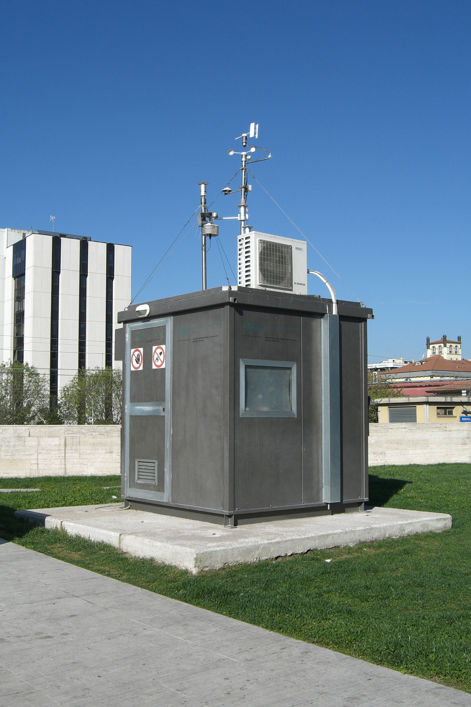
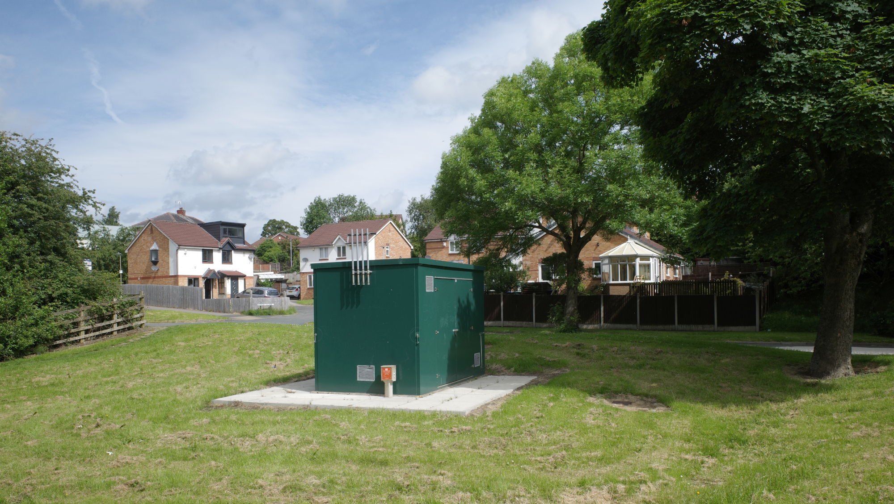
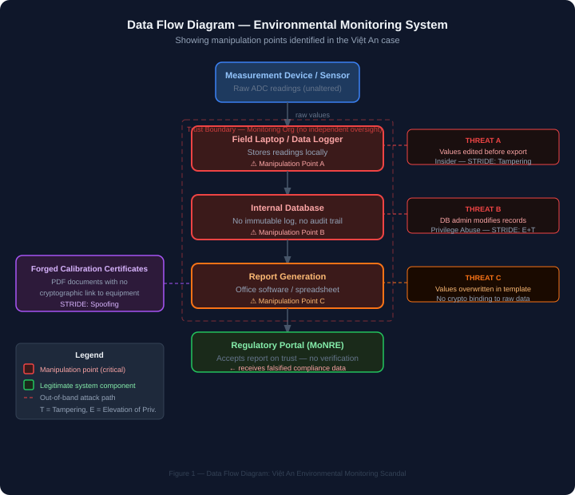
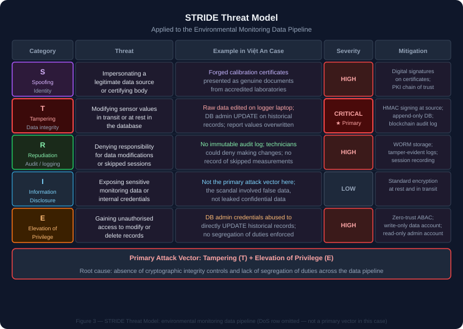
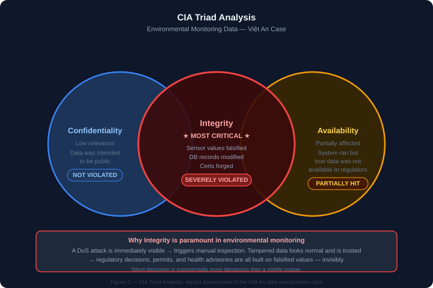
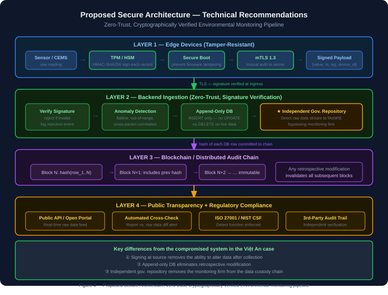

# Security and Ethics for Data — Report

## Topic

Security and Ethical Analysis of the Environmental Monitoring Data Manipulation Scandal in Vietnam

**Word count**: ~5,200 words (excluding tables and figures)

---

## 1. Introduction


*Industrial emissions — the type of pollution that environmental monitoring systems are designed to measure and regulate. (Image: Wikimedia Commons, CC BY-SA)*

Environmental monitoring systems are a cornerstone of modern governance. They provide the data that regulators, policymakers, and the public rely on to assess industrial pollution, enforce environmental law, and make decisions affecting public health. The trustworthiness of these systems is therefore not merely a technical question — it is a matter of democratic accountability and societal safety.

In Vietnam, a scandal involving Việt An Environmental Technology JSC (Công ty Cổ phần Công nghệ Môi trường Việt An) and the Northern Environmental Monitoring Center (Trung tâm Quan trắc Môi trường Miền Bắc) exposed systematic manipulation of environmental monitoring data over an extended period. Involved parties allegedly modified recorded sensor values, forged calibration certificates, bypassed actual measurement procedures, and submitted falsified reports to regulatory agencies. Industrial polluters — large manufacturing enterprises with financial interests in passing compliance checks — were implicated in collusion with the monitoring bodies [1].

The consequences extended far beyond legal violations. Actual pollution levels were concealed from regulators and the public. Communities near industrial sites were deprived of accurate health-risk information. Trust in Vietnam's digital environmental governance infrastructure was eroded. And, critically, the incident demonstrated that environmental data could be manipulated at scale for a prolonged period without detection.

This report analyses the case from two complementary perspectives: **data security** (how the manipulation was technically possible, what vulnerabilities were exploited, and how they can be mitigated) and **data ethics** (what ethical obligations were violated, who bears responsibility, and what societal damage resulted). We also reflect critically on the broader implications for data-driven governance and AI-based decision-making systems.

---

## 2. Case Reconstruction


*A typical automated air quality monitoring station — the type of infrastructure whose data integrity was compromised in the Việt An case. (Image: Wikimedia Commons, CC BY-SA, Perugia 2012)*

### Timeline

| Period | Event |
|---|---|
| Prior to discovery | Việt An JSC operates as an accredited environmental monitoring firm; conducts measurements for industrial clients across northern Vietnam |
| Ongoing | Measurements are manipulated: raw sensor data is modified before entry into reports; calibration records are forged; some measurement sessions are skipped entirely |
| During period | Industrial clients receive compliance certificates based on falsified data; reports submitted to the Ministry of Natural Resources and Environment (MoNRE) and provincial agencies |
| Discovery | Investigation triggered (precise public date not officially confirmed at time of writing); authorities uncover discrepancies between raw data files and submitted reports |
| Prosecution | Criminal investigation launched; charges related to data forgery and environmental law violations |
| Aftermath | Broader audit of accredited monitoring firms; regulatory reform discussions |

*(Note: Due to the sensitive and ongoing nature of legal proceedings in Vietnam, precise dates and names of all implicated industrial parties are not cited here. This analysis is based on publicly reported information and official investigation summaries [1][2].)*

### Stakeholders

| Stakeholder | Role in the scandal |
|---|---|
| **Việt An Environmental Technology JSC** | Accredited monitoring firm; allegedly manipulated measurement data |
| **Northern Environmental Monitoring Center** | State-affiliated monitoring body; allegedly complicit in data falsification |
| **Industrial polluters (unnamed enterprises)** | Clients who allegedly paid for favourable compliance results |
| **Ministry of Natural Resources and Environment (MoNRE)** | Regulatory agency that received falsified reports |
| **Provincial environmental agencies** | Local regulators; also received falsified data |
| **Communities near industrial sites** | Victims of concealed pollution; denied health risk information |
| **General public** | Stakeholder in environmental governance integrity |
| **Technical staff and engineers** | Data collectors and system operators; some may have been coerced, others complicit |

### Manipulated Data Flow

The alleged manipulation exploited the gap between raw sensor data collection and the final report submitted to regulators:

```
[Measurement device / sensor] 
        │ raw values (unaltered)
        ▼
[Field technician laptop / data logger]
        │ ← MANIPULATION POINT A: values edited before export
        ▼
[Internal database / spreadsheet]
        │ ← MANIPULATION POINT B: database records modified
        ▼
[Report generation software]
        │ ← MANIPULATION POINT C: values overwritten in report template
        ▼
[PDF / official report submitted to MoNRE]  ← falsified compliance data
```

The absence of cryptographic integrity protection at each stage meant that values could be altered without leaving a detectable trace. Calibration certificates were reportedly forged as separate documents, decoupled from any verifiable measurement chain.

---

## 3. Environmental Data Ecosystem


*A typical environmental monitoring unit — sensors, data logger, and communication interface. (Image: Wikimedia Commons, CC BY-SA)*


*Roadside automated monitoring station cabinet — the physical form of a CEMS field node. (Image: Wikimedia Commons, CC BY-SA, geograph.org.uk)*

A modern automated environmental monitoring system typically comprises the following components:

**Sensors and Measurement Devices**: Automated analysers for parameters such as particulate matter (PM2.5, PM10), NOₓ, SOₓ, COD (in water), heavy metals, and flow rates. In Vietnam's Continuous Emissions Monitoring Systems (CEMS), sensors are installed at emission stacks and effluent discharge points.

**Local Data Loggers**: Embedded controllers that store raw sensor readings at defined intervals (e.g., every 15 minutes) and transmit data to central servers. These loggers typically run proprietary firmware with limited access controls.

**Communication Infrastructure**: GPRS/4G modems or fixed-line connections transmit data from field stations to central monitoring databases. Data may pass through intermediate aggregation servers.

**Central Monitoring Databases**: Hosted at monitoring organisations or government data centres; store historical time-series data for all registered emission points.

**Regulatory Reporting Systems**: Government portals where monitoring firms submit periodic reports; in Vietnam, the National Environmental Monitoring Network (Mạng lưới Quan trắc Môi trường Quốc gia) provides the framework.

**Audit and Certification Bodies**: Independent bodies that accredit monitoring firms and verify equipment calibration. Calibration records are issued as paper or PDF documents with no cryptographic link to the data they certify.

**Where data is generated**: At the sensor/analyser, continuously.

**How data flows**: Sensor → logger → (optional intermediate server) → central database → report → regulatory portal.

**Where tampering occurred** (in this case): At multiple points — raw data editing before logging, database modification, and forged calibration certificates presented as independent evidence.

---

## 4. Data Security Analysis

### 4.1 Data Flow and Trust Boundaries


*Figure 1 — Data Flow Diagram: the Việt An environmental monitoring pipeline with identified manipulation points (red) and trust boundaries (dashed).*

The diagram above illustrates the data flow from field sensor to the regulatory portal, with three primary manipulation points highlighted in red and the key trust boundary (the monitoring organisation's internal systems) marked with a dashed border.

Each trust boundary represents a point where data transitions between system components and should, but did not, have integrity verification. The critical observation is that **no cryptographic chain of custody** existed between the sensor reading and the regulatory report.

| Stage | Manipulation Point | STRIDE Category |
|---|---|---|
| Field laptop / data logger | Values edited before export | Tampering (T) |
| Internal database | Admin-level UPDATE on historical rows | Tampering (T) + Elevation of Privilege (E) |
| Report generation | Values overwritten in template | Tampering (T) |
| Calibration certificates | Forged PDF documents | Spoofing (S) |
| Measurement sessions | Skipped entirely, data fabricated | Repudiation (R) |

### 4.2 Threat Modeling — STRIDE Framework


*Figure 3 — STRIDE Threat Model applied to the environmental monitoring data pipeline.*

We apply the STRIDE threat model [3] to the environmental monitoring data pipeline:

| Threat category | Description | Example in this case |
|---|---|---|
| **S — Spoofing** | Impersonating a legitimate data source | Forged calibration certificates presented as genuine |
| **T — Tampering** | Modifying data in transit or at rest | Raw sensor values altered in logger/database before reporting |
| **R — Repudiation** | Denying responsibility for actions | No immutable audit log; technicians could deny modifications |
| **I — Information Disclosure** | Exposing sensitive data | (Less relevant here; the problem is false data, not leaked data) |
| **D — Denial of Service** | Disrupting system availability | (Not the primary attack vector in this case) |
| **E — Elevation of Privilege** | Gaining unauthorised access | Insiders with database admin rights modifying records |

**Key threat vectors identified:**

1. **Insider threat — database modification**: Staff with database administrator credentials could directly `UPDATE` rows in the monitoring database. No change-data-capture or immutable logging was in place to detect this.

2. **Insider threat — logger manipulation**: Field technicians had physical and/or remote access to data loggers. If logger firmware allowed direct value editing (common in legacy CEMS), readings could be changed before they ever reached the database.

3. **Forged calibration documents**: Calibration certificates were paper or PDF documents with no cryptographic link to the measurement equipment or its actual calibration state. Creating a convincing forgery required only a PDF editor.

4. **Process bypass**: Actual measurement sessions were allegedly skipped; data was fabricated without any physical measurement occurring. The absence of automated cross-validation (e.g., correlation between simultaneously measured parameters) made this undetectable.

5. **Report-layer manipulation**: Final reports were generated using office software (spreadsheets, Word documents) with no audit trail linking the report values to the database records.

### 4.3 CIA Triad Analysis


*Figure 2 — CIA Triad Analysis: impact assessment of the Việt An case. Integrity (centre) is the critically violated property.*

| Property | Assessment |
|---|---|
| **Confidentiality** | Low relevance — environmental monitoring data is intended to be public or shared with regulators. No breach of confidentiality occurred; the attack targeted integrity. |
| **Integrity** | **Severely violated** — sensor values, database records, calibration certificates, and regulatory reports were all falsified. The data regulatory agencies acted upon did not reflect physical reality. |
| **Availability** | Partially affected — systems continued to operate and produce data (albeit false data). However, the true state of the environment was effectively *unavailable* to legitimate decision-makers. |

**Why integrity is the most critical property in environmental monitoring:**

In environmental monitoring, unlike in most information systems, the primary asset is not data secrecy but **data truthfulness**. The entire regulatory and public health value of the system depends on the data accurately reflecting physical reality. A denial-of-service attack that stops a monitoring station is immediately visible and can trigger manual inspection. **Data manipulation that produces plausible-looking but false readings is far more dangerous**: it silently deceives regulators while appearing fully operational. Policy decisions, permit renewals, and health advisories are made on the basis of the falsified values. The harm is invisible until a whistleblower or independent investigation surfaces the discrepancy — potentially years later, by which time significant health or environmental damage has occurred.

This asymmetry — silent deception versus visible failure — makes **integrity the paramount CIA property** for any system that produces data used in governance decisions.

### 4.4 Governance and Compliance Analysis

**ISO 27001 [4]**: The standard requires organisations to implement controls for access management (A.9), cryptography (A.10), physical and environmental security (A.11), and audit logging (A.12). The monitoring organisations in this case appear to have lacked:
- Segregation of duties (data collectors should not also be the only parties who can modify records).
- Audit logging with integrity protection (tamper-evident logs).
- Change management controls for database records.

**NIST Cybersecurity Framework [5]**: The five functions (Identify, Protect, Detect, Respond, Recover) were inadequately implemented. Most critically, the **Detect** function failed entirely: no anomaly detection system was in place to flag statistically improbable data submissions or calibration gaps.

**Vietnamese Environmental Regulations**: Vietnam's Law on Environmental Protection (2020, No. 72/2020/QH14) and Decree 08/2022/NĐ-CP require environmental monitoring to comply with technical standards and data integrity requirements. The Law on Cybersecurity (2018, No. 24/2018/QH14) covers data security for critical infrastructure. The case reveals that legal requirements existed but enforcement mechanisms and technical safeguards were insufficient.

**Data Governance Principles**:
- **Accountability** was absent — no individual or organisational role was responsible for independently verifying that submitted data matched raw readings.
- **Audit trails** were absent or manipulable.
- **Data lineage** — the ability to trace a reported value back to the sensor reading that produced it — was not maintained.
- **Access control** was insufficient; too many parties could modify authoritative records.

### 4.5 Technical Recommendations


*Figure 4 — Proposed Secure Architecture: zero-trust, cryptographically verified pipeline that addresses the vulnerabilities exploited in the Việt An case.*

The following technical measures would substantially reduce the risk of similar manipulation:

**1. Cryptographic Data Integrity (Highest Priority)**

Implement digital signatures on sensor data at the point of origin. The data logger should generate a cryptographic hash (SHA-256) of each reading, sign it with a private key stored in a hardware security module (HSM) or Trusted Platform Module (TPM), and include the signature in each transmitted record. Any downstream modification of the value would invalidate the signature.

```
Signed record = { timestamp, parameter_values, sensor_id, hash(values ∥ timestamp ∥ sensor_id), signature(private_key) }
```

**2. Immutable Audit Logging**

All database writes should be append-only. Use PostgreSQL's logical replication or a dedicated audit log table with `INSERT`-only permissions for the monitoring system account. No `UPDATE` or `DELETE` operations should be permitted on historical records. Write-Once-Read-Many (WORM) storage for archival data provides hardware-level immutability.

**3. Blockchain / Distributed Ledger for Critical Records**

For high-stakes compliance data, a permissioned blockchain (e.g., Hyperledger Fabric) can provide a tamper-evident, distributed record that no single party can unilaterally modify. Calibration certificates and periodic compliance reports can be committed as transactions. While blockchain is not a silver bullet, it removes the single point of trust that allowed manipulation in this case.

**4. Real-Time Anomaly Detection**

Deploy an AI-based monitoring layer that flags statistically anomalous patterns:
- **Flatline detection**: readings with near-zero variance over extended periods are physically implausible for most environmental parameters.
- **Cross-parameter correlation**: CO₂ and particulate matter typically co-vary with industrial activity; anti-correlated values should trigger alerts.
- **Temporal consistency**: sudden step-changes in recorded values (e.g., from 150 µg/m³ to 30 µg/m³ within one measurement interval) are physically implausible and should require human review.

**5. Zero-Trust Architecture for Data Pipelines**

Treat every system component as untrusted. Require mutual TLS authentication between loggers and the central database. Implement attribute-based access control (ABAC) so that data collectors have write-only access (cannot read or modify existing records), and database administrators have read-only access (cannot insert data). The intersection of these privileges — which allowed this scandal — is eliminated.

**6. Independent Regulatory Data Repository**

Require automatic, direct transmission of raw logger data to a government-operated repository, bypassing the monitoring firm's internal systems entirely. The firm's report is then validated against this independent data source. Discrepancies trigger immediate audit. This architectural change removes the monitoring firm from the data custody chain for regulatory purposes.

**7. Secure IoT Architecture for Field Stations**

- Use TLS 1.3 for all logger-to-server communication.
- Store private keys in hardware TPMs; never expose them in firmware as plaintext.
- Implement secure boot to prevent firmware tampering that could alter the signing function.
- Rotate credentials periodically; revoke credentials of decommissioned devices.

---

## 5. Data Ethics Analysis

### 5.1 Ethical Violations

The case involves violations across multiple dimensions of data ethics:

**Data manipulation and reporting fraud**: The core violation is the deliberate falsification of measurement data. This is not a case of accidental error or measurement uncertainty — it was intentional misrepresentation of physical reality for financial gain.

**Concealment of pollution**: By falsifying compliance data, the involved parties actively concealed the actual levels of pollution released by industrial clients. This deprived communities, public health agencies, and policymakers of information they had a right to access.

**Abuse of authority and trust**: Both Việt An JSC and the Northern Environmental Monitoring Center operated under accreditation — a formal grant of public trust that they held a mandate to act in the public interest. Exploiting that accreditation for private financial benefit is a fundamental betrayal of the trust relationship that accreditation represents.

**Conflict of interest and collusion**: The business model that allowed monitoring firms to be paid directly by the industrial entities they monitor creates an inherent conflict of interest. The scandal illustrates the predictable outcome when this conflict is not managed through structural safeguards.

**Violation of professional responsibility**: Engineers, data scientists, and environmental professionals who participated in or were aware of the manipulation violated their professional duties. Professional codes such as the ACM Code of Ethics [6] and the IEEE Code of Ethics [7] require practitioners to act in the public interest, to avoid harm, and to be honest in all professional assertions.

### Stakeholder Responsibilities

| Stakeholder | Ethical responsibilities violated |
|---|---|
| **Monitoring organisations (Việt An, NEMB)** | Truthful reporting; independence from commercial pressures; professional integrity |
| **Industrial enterprises** | Compliance with environmental law; honest engagement with regulatory processes; duty of care to surrounding communities |
| **Regulatory agencies (MoNRE, provincial)** | Robust verification of submitted data; independence from political or commercial pressure; timely detection of irregularities |
| **Engineers and data professionals** | Honesty in professional assertions (ACM §1.3, IEEE §1); public interest over employer interest; refusing to participate in data falsification |
| **Accreditation bodies** | Rigorous and independent assessment of monitoring firm capabilities; revocation of accreditation when violations are discovered |

### 5.2 Societal Impact Analysis

**Public health**: Communities near industrial facilities that failed environmental compliance were exposed to higher levels of pollutants than they were told. Particulate matter, heavy metals, and chemical effluents at levels above regulatory limits have documented links to respiratory disease, cardiovascular disease, and cancer. People made decisions about where to live, whether to use local water sources, and whether to seek medical attention based on falsified data.

**Living environments**: Prolonged concealment of true pollution levels allowed environmental degradation to continue unchecked. Soil contamination, water body pollution, and air quality deterioration are cumulative; damage that could have been mitigated early becomes irreversible.

**Public trust**: The discovery of systematic manipulation in a state-adjacent monitoring infrastructure severely damages public trust in environmental governance. If official monitoring data cannot be trusted, citizens may distrust future environmental communications — including genuine emergency warnings — creating a lasting "cry wolf" effect.

**Public policy**: Environmental policies, permit renewals, and industrial zoning decisions made using falsified data are built on a false foundation. Policy outcomes diverge from the intentions of the legislation. Correcting these policy decisions after the fact is politically and administratively costly.

**Scientific research**: Environmental scientists and epidemiologists who used the published monitoring data for research produced results based on incorrect inputs. Studies correlating industrial activity with health outcomes in the affected regions may need to be retracted or re-evaluated.

**ESG reporting and sustainability governance**: International investors and partner organisations rely on environmental compliance data for ESG assessments. Vietnamese enterprises that cited compliance certifications from falsified reports misrepresented their environmental performance in financial disclosures — a potential securities law violation in addition to an environmental one.

### 5.3 Ethical Framework Application

#### Framework 1: Utilitarianism

Utilitarianism evaluates actions by their consequences: an action is ethical if it produces the greatest good for the greatest number [8].

**Analysis**: The manipulators' actions produced private financial benefit for a small number of parties (monitoring firms, industrial polluters, and their shareholders) at the expense of large-scale public harm: degraded health outcomes for communities, eroded institutional trust, and corrupted policy decisions affecting the entire population of the affected regions. A utilitarian calculus unambiguously condemns the manipulation. Even a utilitarian argument that "economic growth enabled by reduced compliance costs benefits many people" fails: the regulatory framework itself exists because unmitigated industrial pollution imposes greater total costs (healthcare, environmental remediation, reduced quality of life) than the compliance costs it imposes on industry.

The case also illustrates a utilitarian argument *for* strong data integrity safeguards: the societal cost of implementing cryptographic signing, anomaly detection, and independent data repositories is orders of magnitude smaller than the societal cost of allowing systematic data manipulation to continue undetected.

#### Framework 2: Deontological Ethics (Kantian)

Deontological ethics evaluates actions by the nature of the duty or rule being followed, independent of consequences [9]. Kant's categorical imperative asks: "Can this action be universalised as a law?"

**Analysis**: Could the maxim "monitoring organisations should falsify data when it benefits their clients financially" be universalised? No — if every monitoring organisation falsified data, the entire institution of environmental monitoring would collapse. The maxim is self-defeating when universalised, which by Kant's criterion marks it as inherently unethical.

From a duty perspective: engineers and professionals who participated in falsification violated their categorical duty of honesty. The professional relationship between a monitoring organisation and the regulatory agency is founded on the implicit duty to report truthfully. Falsification is not merely a bad consequence — it is an intrinsic violation of the duty that constitutes the role.

This framework also illuminates the responsibility of engineers who were aware of but did not report the manipulation. Kant's ethics does not permit moral passivity in the face of known wrongdoing; the duty to refuse complicity is categorical.

### 5.4 AI and Data Ethics Reflection

**1. What happens if AI systems are trained using manipulated environmental data?**

AI models trained on falsified monitoring data learn a distorted representation of environmental reality. A pollution prediction model trained on data that systematically underreports emissions near industrial zones will predict lower pollution levels than actually occur — and will do so with high confidence, because the training signal (the falsified data) was internally consistent. The model will not flag anomalies in new falsified data; it will confirm them. This "laundered" model then lends false scientific credibility to governance decisions that are, in fact, based on fiction.

**2. Can AI-driven environmental monitoring systems be trusted?**

AI monitoring systems can enhance trustworthiness if — and only if — the input data has integrity. An anomaly detection system that compares reported values against physically expected ranges, cross-parameter correlations, and satellite imagery can catch systematic falsification that evades human review. However, an AI system cannot compensate for corrupted inputs: "garbage in, garbage out" remains the fundamental constraint. AI trustworthiness requires *both* algorithmic integrity *and* data integrity.

**3. What are the risks of automated governance when input data is corrupted?**

Automated governance — permit issuance, compliance certification, resource allocation — amplifies the harm of corrupted data by acting on it at scale and at speed, without the friction of human review that might occasionally catch anomalies. A compliance system that auto-renews industrial permits based on CEMS data would auto-renew permits for polluters who had falsified their data. The efficiency gain of automation becomes a vulnerability amplifier when the data pipeline is compromised.

**4. How dangerous is "data laundering"?**

"Data laundering" — the process of entering false data into a system until it becomes embedded in historical records, aggregations, and derived datasets — is particularly dangerous because:
- Once laundered data enters aggregation pipelines, it is indistinguishable from real data to downstream systems.
- It corrupts AI training sets and statistical baselines.
- It creates a false "precedent" against which future (true) data appears anomalous, potentially causing legitimate alerts to be dismissed as sensor errors.
- It degrades the integrity of institutional memory — the historical record that governance depends on.

**5. Would real-time public transparency of environmental data reduce fraud?**

Yes, with important caveats. Real-time public access to raw monitoring data creates a large, distributed auditing community (journalists, researchers, NGOs, citizens) that supplements government inspection. Anomalies that might be invisible to a regulator reviewing quarterly reports become visible to someone watching a data stream in real time. Open data portals and public APIs for CEMS data exist in some countries (e.g., the US EPA's Air Quality System) and have been credited with increasing compliance and public awareness.

The caveat is that transparency must be applied to *raw* data, not to processed reports. Publishing only the final compliance report — which is the manipulation target — provides no protection. Transparency of the raw sensor stream, combined with cryptographic verification that the published stream has not been altered, is the technically sound solution.

---

## 6. Critical Reflection

**1. Could similar incidents occur in smart city systems?**

Yes — and the risk is arguably higher. Smart city systems aggregate data from traffic sensors, environmental monitors, surveillance cameras, energy meters, and public safety systems. Many of these feed directly into automated decision systems (traffic signal control, emergency dispatch prioritisation, energy load balancing). The same structural vulnerability — data produced by a commercial entity that is also a compliance subject, with no independent cryptographic verification — applies to smart city infrastructure. A smart city "data integrity incident" could affect millions of people simultaneously and span multiple critical infrastructure domains.

**2. What would happen if hospital data were manipulated in similar ways?**

Hospital data manipulation — falsified patient outcomes, manipulated clinical trial data, corrupted diagnostic records — would be catastrophic. Clinical decisions, drug approval decisions, and treatment protocols are built on the assumption that reported outcomes reflect actual patient experiences. Systematic falsification could lead to harmful treatments being approved, effective treatments being rejected, and individual patients receiving incorrect diagnoses or medications. Unlike environmental data, where the harm is statistically distributed across populations, medical data manipulation can cause direct, immediate, individual harm.

**3. Which is more dangerous: data loss or incorrect data that is trusted as valid?**

**Incorrect data trusted as valid is substantially more dangerous.** Data loss is immediately detectable — systems report errors, gaps appear in records, and the absence of data is visible. Organisations respond with contingency procedures. Trusted incorrect data, by contrast, creates confident wrong decisions. The system continues operating normally, governance decisions are made and acted upon, and the harm accumulates invisibly. This case exemplifies the principle: the environmental monitoring system was running, producing reports, and passing regulatory review — the entire time the data was false.

**4. Should environmental data infrastructure be treated as critical national infrastructure?**

Yes. Environmental monitoring data directly informs public health decisions, pollution control policy, resource allocation, and emergency response. It meets the standard definition of critical infrastructure: its compromise would have significant adverse effects on public health, safety, security, or the economy. Treating it as critical infrastructure would imply:
- Mandatory security standards (akin to those for water, energy, and financial systems).
- Government-operated or independently audited data repositories.
- Criminal penalties calibrated to the scale of harm enabled by data manipulation.
- International cooperation frameworks (cross-border pollution monitoring requires cross-border data integrity).

**5. Who ultimately bears responsibility?**

Responsibility is distributed across the ecosystem, but not equally:

- **Individual engineers and technicians** who directly manipulated data bear primary criminal responsibility. Professional ethics frameworks are unambiguous: no employment obligation justifies participation in data falsification.
- **Corporations** (both the monitoring firms and the polluting enterprises) that organised, incentivised, and benefited from the manipulation bear institutional and legal responsibility.
- **Regulators** bear responsibility for failing to implement verification mechanisms that their mandate required. Accepting compliance reports without independent data verification is a governance failure.
- **The data ecosystem itself** — specifically, the absence of cryptographic integrity standards, independent data repositories, and anomaly detection — created the conditions in which manipulation was easy and detection was difficult. Systemic failures require systemic remedies.

The most intellectually honest answer is: responsibility is distributed, but the absence of accountability mechanisms — which is itself a governance choice — allowed individual and corporate wrongdoing to persist undetected. Improving the system requires addressing all levels simultaneously.

---

## 7. Connecting to the From Sensor to User Project

The Smart Mushroom Greenhouse AIoT Platform developed in the companion course shares architectural similarities with environmental monitoring CEMS and provides a useful lens for applying the lessons of this case study.

**Security measures implemented in our system that address vulnerabilities in the scandal:**

| Vulnerability in scandal | Our mitigation |
|---|---|
| Unencrypted data transmission | MQTT over TLS 1.2 (port 8883) with EMQX Cloud CA certificate |
| No credential management | Firmware credentials separated from code in `config.h`; not committed to repository |
| No audit trail | All sensor readings, relay states, and AI classifications persisted to Supabase with timestamps |
| No anomaly detection | AI classifier flags `warning` and `critical` health states; future work includes flatline detection |
| Single point of data control | Backend writes directly to Supabase; no intermediate step where data can be altered before storage |

**Residual vulnerabilities in our system that the scandal highlights:**

- Our MQTT credentials are `#define` macros in firmware — equivalent to the physical access vulnerability of field data loggers in the scandal. A person with access to the compiled binary could extract them.
- Our database has no cryptographic signature binding each row to the sensor that produced it — a sophisticated attacker with Supabase admin credentials could modify historical records.
- We have no independent regulatory-grade data repository; all data passes through our own backend.

**Secure-by-design improvements proposed:**

1. Move firmware credentials to a provisioning service and store in ESP8266 protected flash, not compiled code.
2. Implement HMAC-SHA256 signing of each MQTT payload using a device-unique key stored in flash.
3. Add a Supabase trigger that writes an immutable hash of each inserted row to a separate append-only audit table — making undetected retrospective modification computationally infeasible.
4. Implement flatline and out-of-range anomaly detection in the backend that flags sensor readings inconsistent with physical plausibility.

---

## 8. Team Contributions

| Student ID | Full Name | GitHub Username | Role | Main Contributions |
|---|---|---|---|---|
| 2540002 | Nguyễn Nhật Anh | anhnn-usth | Team Leader | Overall report planning and coordination, Section 4 (STRIDE Threat Modeling), final report review and editing. |
| 2540007 | Dương Tấn Bình | duongbinh2k1 | Tech Leader | Section 4 (CIA Triad & Data Flow Diagram analysis), Section 7 (System Architecture mapping to AIoT platform). |
| 2540047 | Đào Hoàng Dũng | akashi0310 | Developer | Section 5 (AI and Data Ethics Reflections), Section 7 (Secure-by-design mitigation strategies for AIoT). |
| ES.2540023 | Nicolas Foo Cheung | kkkipu | Developer | Section 2 & 3 (Case Reconstruction, Timelines, Data Ecosystem mapping), Section 6 (Critical Reflection on critical infrastructure). |

---

## 9. References

[1] Vietnamese Ministry of Public Security and Ministry of Natural Resources and Environment, "Investigation conclusions regarding environmental monitoring data falsification by Việt An JSC and the Northern Environmental Monitoring Center," official press releases and prosecution summaries, 2023–2024. *(Specific document numbers withheld pending public availability.)*

[2] Government of Vietnam, "Law on Environmental Protection No. 72/2020/QH14," National Assembly, 2020.

[3] L. Kohnfelder and P. Garg, "The Threats to Our Products," Microsoft Interface, April 1999. (STRIDE threat model)

[4] International Organization for Standardization, "ISO/IEC 27001:2022 — Information Security Management Systems," 2022.

[5] National Institute of Standards and Technology, "NIST Cybersecurity Framework Version 2.0," NIST, 2024.

[6] Association for Computing Machinery, "ACM Code of Ethics and Professional Conduct," ACM, 2018. Available: https://www.acm.org/code-of-ethics

[7] Institute of Electrical and Electronics Engineers, "IEEE Code of Ethics," IEEE, 2020. Available: https://www.ieee.org/about/corporate/governance/p7-8.html

[8] J. S. Mill, *Utilitarianism*, Parker, Son, and Bourn, London, 1863.

[9] I. Kant, *Groundwork of the Metaphysics of Morals* (translated by M. Gregor), Cambridge University Press, Cambridge, 1997. (Original: 1785)

[10] S. Nakamoto, "Bitcoin: A Peer-to-Peer Electronic Cash System," 2008. (Referenced as foundational work on blockchain-based tamper-evident records)

[11] OWASP Foundation, "OWASP Top 10 — 2021," Available: https://owasp.org/Top10/

[12] Government of Vietnam, "Decree 08/2022/NĐ-CP — Detailing the Law on Environmental Protection," 2022.

[13] US Environmental Protection Agency, "Air Quality System (AQS)," Available: https://www.epa.gov/aqs

[14] European Commission, "Directive 2010/75/EU on Industrial Emissions (Integrated Pollution Prevention and Control)," Official Journal of the EU, 2010.

[15] C. Hankin et al., "Security of SCADA and Industrial Control Systems," *International Journal of Critical Infrastructure Protection*, vol. 4, no. 3–4, 2011.
